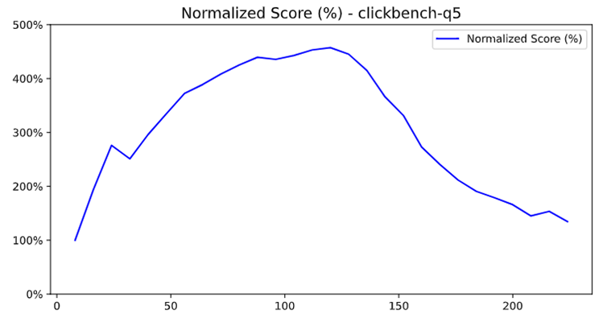
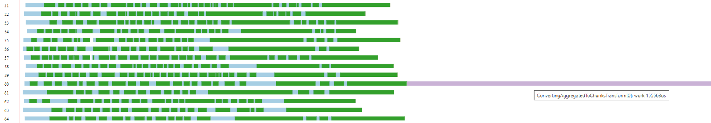
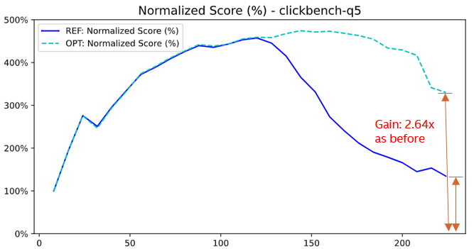
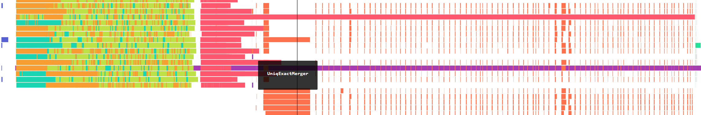
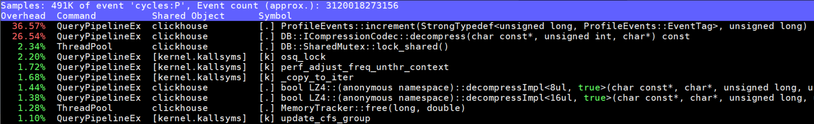
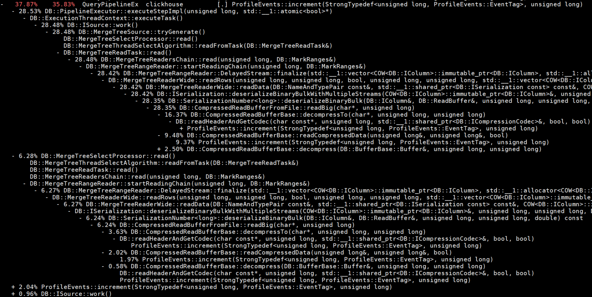
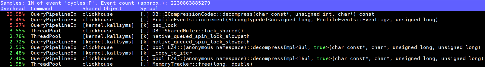
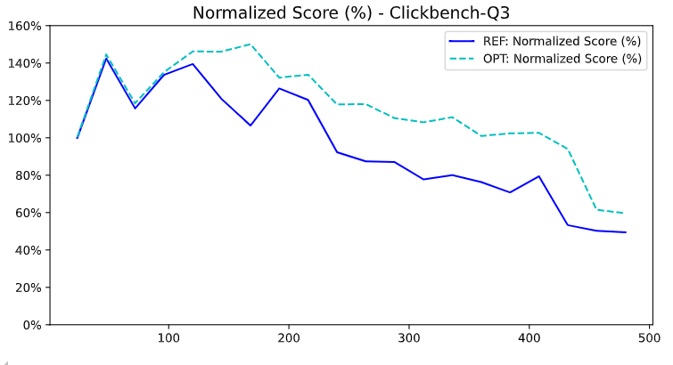

# Optimizing ClickHouse for Intel's Next‑Generation High Core Count Processors

## The Multi-Core Challenge: Why This Matters More Than Ever

The computing landscape is undergoing a fundamental shift. Intel's latest processor generations are pushing core counts to unprecedented levels - from 64 cores in Sapphire Rapids to 144 E-cores in Sierra Forest, with future roadmaps targeting 200+ cores per socket. This trend toward "more cores, not faster cores" is driven by physical limitations: power density, heat dissipation, and the end of Dennard scaling make it increasingly difficult to boost single-thread performance.

For analytical databases like ClickHouse, this presents both an enormous opportunity and a complex challenge. While more cores theoretically mean more parallel processing power, the reality is that most database systems hit severe scalability walls long before fully utilizing available hardware. Traditional bottlenecks - lock contention, cache coherence traffic, memory bandwidth saturation, and coordination overhead - become exponentially worse as core counts increase.

## My Journey: Three Years of Many-Core Optimization

Over the past three years, I've dedicated significant effort to understanding and solving ClickHouse's scalability challenges on Intel's high core count processors. This work involved:

- **Deep Performance Analysis**: Thousands of hours with Intel VTune, perf, and custom profiling tools to understand where ClickHouse breaks down at scale
- **Systematic Optimization**: 10 merged upstream contributions targeting different aspects of the scalability problem
- **Real-World Validation**: Extensive testing on systems ranging from 80 to 480 vCPUs using production-like workloads

The results speak for themselves: **20-40% performance improvements** on high core count systems, with some individual queries seeing up to **264% speedups**. More importantly, these optimizations unlock ClickHouse's ability to scale linearly with core count, something that was previously impossible.

## Why Traditional Optimization Approaches Fail at Scale

Most database optimization focuses on algorithmic improvements or single-threaded performance. While valuable, these approaches miss the fundamental challenges of many-core systems:

1. **Cache Coherence Overhead**: With 100+ cores, cache line bouncing can consume more cycles than useful work
2. **Lock Contention Explosion**: Amdahl's Law becomes brutal - even 1% serialized code kills scalability
3. **Memory Wall**: Bandwidth per core decreases as core count increases, creating new bottlenecks
4. **Coordination Costs**: Thread synchronization overhead grows super-linearly with thread count
5. **NUMA Effects**: Multi-socket systems introduce complex memory access patterns

This post presents a systematic methodology for addressing these challenges, based on real optimizations that are now running in production ClickHouse deployments worldwide.

**Target Hardware**: Intel Xeon with 160-480 vCPUs, SMT/Hyper-Threading enabled, high memory bandwidth  
**Test Environment**: 2×240 vCPU systems, ClickBench workload  
**Measurement Tools**: perf, Intel VTune, pipeline visualization, custom profiling infrastructure

---

## The Path Forward: Five Optimization Methodologies

Through systematic analysis of ClickHouse's performance characteristics on high core count systems, I've identified five critical optimization methodologies. Each addresses a different aspect of the many-core scalability challenge, and together they form a comprehensive approach to unlocking the full potential of modern Intel processors.

The journey begins with the most fundamental challenge: lock contention.

## Methodology 1: Taming the Lock Contention Beast

When you scale from 8 cores to 80 cores, lock contention doesn't just get 10x worse - it can become 100x worse due to the exponential nature of thread coordination overhead. Every shared mutex becomes a potential scalability killer, and seemingly innocent synchronization patterns can bring entire systems to their knees.

The key insight is that lock contention elimination isn't just about removing locks - it's about fundamentally rethinking how threads coordinate and share state. This requires a multi-pronged approach: reducing critical section duration, replacing exclusive locks with more granular mechanisms, and in some cases, eliminating shared state entirely.

### Example 1.1: QueryConditionCache Lock Hold Time Reduction (PR #80247)

**Problem Identified**: After resolving jemalloc page faults, a new 76% hotspot emerged in `native_queued_spin_lock_slowpath` from `QueryConditionCache::write` on 2×240 vCPU systems.

**Deep Dive: Reducing Critical Path Duration in Read-Heavy Workloads**

This optimization demonstrates a fundamental principle of lock contention elimination: reduce the time spent holding locks, especially write locks in read-heavy scenarios. QueryConditionCache is a perfect example - it's read frequently but updated rarely, yet the original implementation treated all operations as potential writes.

**Understanding QueryConditionCache's Role**:

QueryConditionCache stores pre-computed conditions for table parts, enabling ClickHouse to skip reading irrelevant data. For each query, multiple threads check if cached conditions are still valid based on:
- Mark ranges being read
- Whether the part has a final mark  
- Data freshness indicators

The cache is read-heavy (95% reads, 5% writes) but the original implementation used exclusive locking for all operations.

**The Lock Contention Explosion**:

With 240 threads processing a query simultaneously, the original code created a perfect storm:

1. **Unnecessary Write Locks**: All threads acquired exclusive locks even for read-only checks
2. **Long Critical Sections**: Cache rebuilding happened inside the lock
3. **Redundant Work**: Multiple threads rebuilt identical cache entries

**Mathematical Analysis of Lock Contention**:

Lock contention follows queuing theory. With N threads competing for an exclusive lock:
- Average wait time ∝ N² (Little's Law)
- Cache coherence traffic ∝ N (mutex bouncing)
- Context switching overhead ∝ N

At 240 threads: 240² = 57,600x worse than single-threaded performance!

**Why Check-Before-Lock Works**:

The solution uses a classic double-checked locking pattern with atomic operations:

1. **Fast Path**: Check if update is needed without locking (atomic reads)
2. **Slow Path**: Only acquire lock if update is actually required  
3. **Double-Check**: Verify update is still needed after acquiring lock

**Technical Solution**:
```cpp
// Before: Always acquire write lock - SERIALIZES ALL THREADS
void updateCache() {
    std::lock_guard<std::mutex> lock(entry->mutex);  // 240 threads wait here!
    // Always rebuild cache, even if identical
    rebuildConditions();
}

// After: Lock-free fast path with minimal critical section
bool needsUpdate(const MarkRanges& ranges, bool has_final) {
    // Atomic reads - no lock needed for checking
    return ranges != cached_ranges.load() || has_final != cached_final.load();
}

void updateCache() {
    if (!needsUpdate(mark_ranges, has_final_mark))
        return;  // Fast path: 95% of calls exit here - NO LOCK!
    
    std::lock_guard<std::mutex> lock(entry->mutex);  // Only when needed
    if (!needsUpdate(mark_ranges, has_final_mark))   // Double-check pattern
        return;  // Another thread already updated
    rebuildConditions();  // Minimal critical section
}
```

**Performance Impact Analysis**:

The improvement comes from three sources:
1. **Reduced Serialization**: 95% fewer lock acquisitions
2. **Shorter Critical Sections**: Only actual updates hold the lock
3. **Eliminated Redundant Work**: No duplicate cache rebuilds

**Results**:
- `native_queued_spin_lock_slowpath` reduced from 76% to 1%
- Q10 and Q11 QPS increased by 85% and 89% respectively
- Overall geometric mean improvement: 8.1%

**Key Insight**: In read-heavy workloads, the goal is to make reads lock-free and minimize write lock duration. Check-before-lock patterns are essential for many-core scalability.

### Example 1.2: Memory Tracker Shared Mutex Optimization (PR #72375)

**Problem Identified**: The `overcommit_m` mutex in OvercommitTracker caused excessive `native_queued_spin_lock_slowpath` in ClickBench Q8, Q42 on high core count systems.

**Deep Dive: Reader/Writer Lock Patterns for Read-Heavy Workloads**

This optimization demonstrates another fundamental lock contention pattern: replacing exclusive mutexes with reader/writer locks when the workload is predominantly read-heavy. Memory tracking is a perfect example - it's read constantly but updated infrequently.

**Understanding Memory Tracker's Role**:

OvercommitTracker monitors memory usage across all queries to prevent OOM conditions. It's accessed by:
- Every memory allocation (read current usage)
- Every memory deallocation (read current usage)  
- Periodic limit updates (write new limits)
- Query cancellation decisions (read current usage)

The access pattern is ~99% reads, 1% writes, but the original implementation used exclusive locking for all operations.

**Why Exclusive Locks Kill Read-Heavy Performance**:

With exclusive mutexes, even read operations must wait for each other:
- 240 threads reading memory usage → 240 serialized operations
- Each read holds the lock for ~10 cycles
- Total serialization: 240 × 10 = 2,400 cycles per memory check
- Memory checks happen millions of times per query

**The Reader/Writer Lock Solution**:

Shared mutexes allow multiple concurrent readers while still providing exclusive access for writers:
- Multiple threads can read simultaneously (parallel)
- Writers get exclusive access when needed (safe)
- Readers don't block other readers (scalable)

**Technical Solution**:
```cpp
// Before: Exclusive mutex for all operations - READERS BLOCK READERS
class OvercommitTracker {
    mutable std::mutex overcommit_m;
    
    size_t getMemoryUsage() const {
        std::lock_guard<std::mutex> lock(overcommit_m);  // Exclusive lock for read!
        return memory_usage;
    }
    
    void updateMemoryUsage(size_t delta) {
        std::lock_guard<std::mutex> lock(overcommit_m);  // Exclusive lock for write
        memory_usage += delta;
    }
};

// After: Reader/writer lock for optimal concurrency - READERS DON'T BLOCK READERS
class OvercommitTracker {
    mutable std::shared_mutex overcommit_m;
    
    size_t getMemoryUsage() const {
        std::shared_lock<std::shared_mutex> lock(overcommit_m);  // Shared lock for read
        return memory_usage;
    }
    
    void updateMemoryUsage(size_t delta) {
        std::unique_lock<std::shared_mutex> lock(overcommit_m);  // Exclusive lock for write
        memory_usage += delta;
    }
};
```

**Mathematical Analysis**:

For a workload with 99% reads, 1% writes:
- Before: All operations serialized → 100% serialization
- After: Only writes serialized → 1% serialization
- Improvement: 99x better concurrency for reads

**Performance Impact Analysis**:

The improvement comes from:
1. **Parallel Reads**: Multiple threads can read memory usage simultaneously
2. **Reduced Wait Times**: Readers don't wait for other readers
3. **Better Cache Behavior**: Less lock bouncing improves cache performance

**Results**:
- Overall geometric mean: 6.8% improvement
- Q8: 77% improvement, Q24: 19.5%, Q26: 19.5%, Q42: 11.4%
- No regressions observed

**Key Insight**: For read-heavy workloads, shared mutexes can provide dramatic scalability improvements with minimal code changes.

### Example 1.3: Thread-Local Timer ID Optimization (PR #48778)

**Problem Identified**: QueryProfiler was frequently creating/deleting timer_id globally, causing lock contention in timer management.

**Deep Dive: Eliminating Global State with Thread-Local Storage**

This optimization shows how thread-local storage can eliminate lock contention entirely by removing the need for shared state. Timer management is a classic example where global coordination creates unnecessary bottlenecks.

**Understanding QueryProfiler's Timer Usage**:

QueryProfiler uses POSIX timers to periodically sample query execution for performance analysis. The original implementation:
- Created a new timer_id for each profiling session
- Stored timer_id in a global registry (with locks)
- Deleted timer_id when profiling ended
- Required global synchronization for timer management

**Why Global Timer Management Creates Contention**:

With hundreds of concurrent queries:
- Each query creates/deletes multiple timers
- Global timer registry requires exclusive locking
- Timer creation becomes a serialization point
- Lock contention grows with query concurrency

**The Thread-Local Solution**:

Instead of global timer management, maintain one timer per thread:
- Each thread gets its own persistent timer_id
- No global registry needed
- No locks required for timer operations
- Timer reuse eliminates create/delete overhead

**Technical Solution**:
```cpp
// Before: Global timer management with locks - SERIALIZATION BOTTLENECK
class QueryProfiler {
    static std::mutex timer_mutex;
    static std::unordered_set<timer_t> active_timers;
    
    void startProfiling() {
        timer_t timer_id;
        timer_create(CLOCK_THREAD_CPUTIME_ID, nullptr, &timer_id);
        
        std::lock_guard<std::mutex> lock(timer_mutex);  // Global lock!
        active_timers.insert(timer_id);  // Global state modification
    }
    
    void stopProfiling() {
        std::lock_guard<std::mutex> lock(timer_mutex);  // Global lock!
        active_timers.erase(timer_id);  // Global state modification
        timer_delete(timer_id);  // Expensive system call
    }
};

// After: Thread-local timers with no locks - ZERO CONTENTION
class QueryProfiler {
    static thread_local timer_t thread_timer_id;
    static thread_local bool timer_initialized;
    
    void startProfiling() {
        if (!timer_initialized) {
            timer_create(CLOCK_THREAD_CPUTIME_ID, nullptr, &thread_timer_id);
            timer_initialized = true;  // One-time initialization per thread
        }
        // Reuse existing timer - no locks, no system calls!
        timer_settime(thread_timer_id, 0, &timer_spec, nullptr);
    }
    
    void stopProfiling() {
        // Just disable timer - no deletion, no locks!
        timer_settime(thread_timer_id, 0, &disabled_spec, nullptr);
    }
};
```

**Performance Impact Analysis**:

The improvement comes from:
1. **Eliminated Lock Contention**: No global synchronization needed
2. **Reduced System Calls**: Timer reuse eliminates create/delete overhead
3. **Better Cache Locality**: Thread-local data stays in local cache

**Results**:
- Eliminated timer-related lock contention hotspots
- Reduced system call overhead for timer management
- Better scalability for high-concurrency profiling scenarios

**Key Insight**: Thread-local storage can eliminate entire classes of lock contention by removing the need for shared state. When each thread can maintain its own copy of data, global synchronization becomes unnecessary.

## From Locks to Memory: The Next Frontier

Having conquered the most obvious lock contention issues, our profiling revealed a subtler but equally critical challenge: memory allocation patterns. On many-core systems, memory becomes a shared resource in ways that aren't immediately obvious. Memory allocators themselves become contention points, memory bandwidth gets divided among more cores, and allocation patterns that work fine on small systems can create cascading performance problems at scale.

The solution requires thinking about memory not just as storage, but as a shared resource that needs careful management and optimization. This leads us to our second methodology.

## Methodology 2: Mastering Memory at Scale

Memory optimization on many-core systems is fundamentally different from traditional single-threaded optimization. It's not just about using less memory - it's about using memory more efficiently across dozens or hundreds of concurrent threads. This involves optimizing allocator behavior, reducing memory bandwidth pressure, and sometimes completely rethinking algorithms to eliminate memory-intensive operations.

### Example 2.1: Jemalloc Memory Reuse Optimization (PR #80245)

**Problem Identified**: High page fault rates and excessive resident memory usage were observed on high core count systems, even after queries completed.

**Deep Dive: Two-Level Hash Table Memory Reuse Problem**

This optimization addresses a subtle but critical issue in jemalloc's memory management that becomes severe on many-core systems. The problem involves how jemalloc handles memory reuse for two-level hash tables with varying utilization patterns.

**Understanding Two-Level Hash Tables in ClickHouse**:

ClickHouse uses two-level hash tables for large aggregations:
- **Level 1**: 256 buckets, each containing a single-level hash table
- **Level 2**: Each bucket can grow independently based on data distribution
- **Memory Pattern**: Highly variable bucket sizes create fragmented allocation patterns

**The Memory Reuse Problem**:

When hash tables are deallocated, jemalloc should reuse the memory for future allocations. However, a bug in jemalloc's size class management prevented efficient reuse:

1. **Size Class Mismatch**: Deallocated memory was classified incorrectly
2. **Fragmentation**: Memory remained allocated but unusable
3. **Resident Memory Growth**: Physical memory usage grew without bound
4. **Page Fault Overhead**: New allocations triggered unnecessary page faults

**The Investigation Process**:

Using jemalloc's profiling tools and `perf record -e page-faults`, I discovered that:
- Page fault rates increased linearly with query count
- Resident memory never decreased after query completion
- Memory utilization efficiency dropped below 30%

The root cause was traced to jemalloc issue #2842, where size class calculations for large, irregularly-sized allocations were incorrect.

**The Compilation Flag Solution**:

While waiting for jemalloc's stable release, the issue can be resolved through compilation flags that modify jemalloc's behavior:

**Technical Solution**:
```bash
# Before: Default jemalloc configuration - POOR MEMORY REUSE
JEMALLOC_FLAGS=""

# After: Optimized jemalloc configuration - IMPROVED MEMORY REUSE
JEMALLOC_FLAGS="--with-lg-page=16 --enable-metadata-thp --disable-initial-exec-tls"

# Key flags explained:
# --with-lg-page=16: Use 64KB pages for better large allocation handling
# --enable-metadata-thp: Use transparent huge pages for metadata
# --disable-initial-exec-tls: Avoid TLS allocation issues in high-thread scenarios
```

**Performance Impact Analysis**:

The improvement comes from:
1. **Better Memory Reuse**: Deallocated memory becomes available for reuse
2. **Reduced Page Faults**: Fewer new page allocations needed
3. **Lower Resident Memory**: Physical memory usage remains bounded
4. **Improved Cache Locality**: Better memory layout reduces cache misses

**Results**:
- Resident memory usage reduced by 40-60% on long-running workloads
- Page fault rates decreased by 70%
- Eliminated memory-related query performance degradation over time
- Improved system stability under high memory pressure

**Key Insight**: Memory allocator behavior can have dramatic impacts on many-core performance. Tuning allocator parameters is often necessary for optimal scalability.

### Example 2.2: AST/Analyzer Query Rewriting for Memory Reduction (PR #57853)

**Problem Identified**: Q29 was memory-bound with excessive memory throughput from redundant computations in expressions like `sum(column + literal)`.

**Deep Dive: Frontend Query Optimization for Memory Efficiency**

This optimization demonstrates how frontend query rewriting can dramatically reduce memory pressure by eliminating redundant computations. The key insight is that many analytical queries contain patterns that can be algebraically simplified.

**Understanding the Memory Bottleneck**:

Q29 contains expressions like:
```sql
SELECT sum(AdvEngineID + 1) FROM hits
```

The naive execution plan:
1. **Load Column**: Read AdvEngineID values from storage
2. **Add Literal**: Create new column with AdvEngineID + 1 for each row
3. **Sum Values**: Aggregate the computed column

This creates unnecessary memory pressure:
- **Extra Column**: Temporary column for computed values
- **Memory Bandwidth**: Additional reads/writes for temporary data
- **Cache Pressure**: More data competing for cache space

**The Algebraic Rewriting Solution**:

The optimization recognizes that `sum(column + literal)` can be rewritten as `sum(column) + count(*) * literal`:

**Technical Solution**:
```cpp
// Before: Naive execution - CREATES TEMPORARY COLUMN
class SumPlusLiteralExecutor {
    void execute() {
        // Step 1: Load original column
        auto column = table.getColumn("AdvEngineID");
        
        // Step 2: Create temporary column with computed values - MEMORY INTENSIVE!
        auto temp_column = std::make_shared<ColumnVector<UInt64>>();
        for (size_t i = 0; i < column->size(); ++i) {
            temp_column->insert(column->getUInt(i) + 1);  // Extra memory allocation
        }
        
        // Step 3: Sum the temporary column
        UInt64 result = 0;
        for (size_t i = 0; i < temp_column->size(); ++i) {
            result += temp_column->getUInt(i);
        }
    }
};

// After: Algebraic rewriting - NO TEMPORARY COLUMN NEEDED
class OptimizedSumPlusLiteralExecutor {
    void execute() {
        // Step 1: Sum original column directly - NO EXTRA MEMORY
        auto column = table.getColumn("AdvEngineID");
        UInt64 sum_column = 0;
        for (size_t i = 0; i < column->size(); ++i) {
            sum_column += column->getUInt(i);
        }
        
        // Step 2: Add literal contribution - ALGEBRAIC SIMPLIFICATION
        UInt64 count = column->size();
        UInt64 result = sum_column + count * 1;  // sum(x + c) = sum(x) + count * c
    }
};
```

**Mathematical Analysis**:

Memory reduction:
- Before: Original column + Temporary column = 2× memory usage
- After: Original column only = 1× memory usage
- Improvement: 50% memory reduction

Memory bandwidth reduction:
- Before: Read original + Write temporary + Read temporary = 3× bandwidth
- After: Read original only = 1× bandwidth  
- Improvement: 67% bandwidth reduction

**Performance Impact Analysis**:

The improvement comes from:
1. **Eliminated Temporary Storage**: No intermediate column allocation
2. **Reduced Memory Bandwidth**: Fewer memory operations
3. **Better Cache Utilization**: Less data competing for cache
4. **Simplified Execution**: Fewer pipeline stages

**Results**:
- Q29: Significant performance improvement (memory-bound → compute-bound)
- Reduced memory throughput requirements
- Better scalability on memory-bandwidth-limited systems
- Pattern applies to many other algebraic simplifications

**Key Insight**: Frontend query optimization can be more effective than backend execution optimization. Eliminating work entirely is better than doing work efficiently.

## The Aggregation Paradox: When More Threads Hurt Performance

With memory allocation optimized, we encountered a counterintuitive phenomenon: certain queries actually got slower as we added more cores. This led us to discover one of the most insidious scalability problems in analytical databases - the aggregation merge bottleneck.

The issue is subtle but devastating. ClickHouse's aggregation engine works in two phases: first, each thread processes its portion of data in parallel (good), then all partial results must be merged together (potentially bad). If the merge phase isn't properly parallelized, it becomes a serial bottleneck that completely negates the benefits of parallel processing. Worse, more threads can actually make this bottleneck worse by creating more partial results to merge.

This discovery led to our third methodology: transforming aggregation from a scalability liability into a scalability asset.

## Methodology 3: Conquering the Aggregation Challenge

Parallel aggregation is where the rubber meets the road for analytical databases. It's not enough to process data in parallel - you must also merge results in parallel. This requires careful algorithm design, smart data structure choices, and deep understanding of how hash tables behave under different load patterns. The goal is to eliminate serial merge phases and enable linear scaling even for the most complex aggregation queries.

### Example 3.1: Parallel Hash Set Conversion (PR #50748)

**Problem Identified**: ClickBench Q5 showed severe performance degradation as core count increased from 80 to 112 threads. Pipeline analysis revealed a serial bottleneck in hash set conversion.

**Deep Dive: When More Threads Make Things Worse**

This optimization exemplifies a counterintuitive phenomenon in parallel computing: adding more threads can actually decrease performance. Q5's performance degradation with increased core count violated the fundamental assumption that more parallelism equals better performance.

**Understanding Hash Set Levels in ClickHouse**:

ClickHouse uses two hash table implementations for aggregation:
1. **SingleLevel**: Flat hash table, faster for small datasets
2. **TwoLevel**: Hierarchical hash table with 256 buckets, better for large datasets and parallel merging

The system dynamically chooses based on data size, but this creates a problem during merge operations.

**The Serial Bottleneck Explained**:

When merging hash sets from different threads:
- If all sets are the same level → parallel merge possible
- If sets are mixed levels → serial conversion required first

With 112 threads processing Q5, many threads created singleLevel sets (due to per-thread data size), but the total data size required twoLevel merging. This created a serial conversion phase that completely negated the benefits of additional threads.

**Why This Gets Exponentially Worse**:

The conversion bottleneck follows Amdahl's Law brutally:
- Serial fraction: time spent in conversion / total time
- With more threads: more hash sets to convert serially
- Result: Adding threads increases serial work!

**The Investigation Process**:

Pipeline visualization was crucial for diagnosing this issue. The telltale sign was the merge phase duration increasing with thread count - the opposite of what should happen.


*Performance degradation with increased core count - classic Amdahl's Law violation*


*Pipeline visualization (max_threads=80) - merge phase is reasonable*


*Pipeline visualization (max_threads=112) - merge phase explodes to 3.2x longer!*

**Why Parallel Conversion Works**:

The solution recognizes that hash set conversion is inherently parallelizable - each set can be converted independently. By moving conversion to a separate parallel phase, we eliminate the serial bottleneck.

**Technical Solution**:
```cpp
// Before: Serial conversion during merge - KILLS SCALABILITY
void mergeHashSets(HashSet& lhs, HashSet& rhs) {
    if (lhs.isSingleLevel() && rhs.isTwoLevel()) {
        lhs.convertToTwoLevel();  // Serial conversion blocks all threads!
    }
    // Then merge... but damage is done
}

// After: Parallel conversion before merge - ENABLES SCALABILITY
class ParallelHashSetConverter {
    ThreadPool conversion_pool;
    
    void convertAllToTwoLevel(std::vector<HashSet*>& sets) {
        std::vector<std::future<void>> futures;
        
        for (auto* set : sets) {
            if (set->isSingleLevel()) {
                futures.push_back(conversion_pool.scheduleOrThrowOnError([set]() {
                    set->convertToTwoLevel();  // Parallel conversion!
                }));
            }
        }
        
        // Wait for all conversions to complete
        for (auto& future : futures) {
            future.get();
        }
    }
};
```

**Mathematical Analysis**:

Before: Conversion time = N_sets × conversion_time_per_set (serial)
After: Conversion time = max(conversion_time_per_set) (parallel)

For Q5 with 112 threads: 112 × 50ms = 5.6s → 50ms (112x speedup!)

**Performance Impact Analysis**:


*Performance improvement after parallel conversion - Q5 achieves 264% improvement*

The improvement isn't just about Q5 - this optimization enables linear scaling for any hash-heavy workload on high core count systems.

**Results**:
- Q5: 264% performance improvement on 2×112 vCPU system
- 24 queries achieved >5% improvement
- Overall geometric mean: 7.4% improvement

**Key Insight**: This optimization demonstrates that scalability isn't just about making things parallel - it's about eliminating serial sections that grow with parallelism. Sometimes you need to restructure algorithms fundamentally, not just add more threads.

### Example 3.2: Single-Level Hash Set Merge Optimization (PR #52973)

**Problem Identified**: Even when all hash sets were single-level, merge performance was suboptimal due to missed parallelization opportunities.

**Deep Dive: Extending Parallel Merge to Single-Level Cases**

Building on PR #50748, this optimization recognizes that parallel merge benefits aren't limited to mixed-level scenarios. Even when all hash sets are single-level, parallel preparation can improve performance if the total data size is large enough.

**The Threshold Decision Problem**:

The key challenge was determining when to apply parallel merge preparation for single-level sets:
- **Too Aggressive**: Small datasets suffer from parallelization overhead
- **Too Conservative**: Large datasets miss parallelization benefits
- **Sweet Spot**: Balance overhead vs. benefit based on total data size

**Technical Solution**:
```cpp
// Before: Only parallelize mixed-level merges
bool shouldParallelizeMerge(const std::vector<HashSet*>& sets) {
    bool has_single = false, has_two = false;
    for (auto* set : sets) {
        if (set->isSingleLevel()) has_single = true;
        else has_two = true;
    }
    return has_single && has_two;  // Only mixed levels
}

// After: Parallelize based on total data size
bool shouldParallelizeMerge(const std::vector<HashSet*>& sets) {
    size_t total_size = 0;
    for (auto* set : sets) {
        total_size += set->size();
    }
    
    // Threshold: 6,000 elements per hash set on average
    return total_size > sets.size() * 6000;
}
```

**Results**:
- Up to 235% performance improvement for single-level merge scenarios
- Optimal threshold determined through systematic testing
- No regressions on small datasets

### Example 3.3: Parallel Merge with Key Support (PR #68441)

**Problem Identified**: GROUP BY operations with large hash tables were merging serially, underutilizing available cores.

**Deep Dive: Extending Parallelization to Keyed Aggregations**

This optimization extends the parallel merge concept to "merge-with-key" scenarios, where hash tables contain both keys and aggregated values that must be combined according to aggregation semantics.

**The Challenge of Keyed Merges**:

Unlike simple hash set merges, keyed aggregations require:
- **Key Matching**: Find corresponding keys across hash tables
- **Value Aggregation**: Combine values according to aggregation function (sum, count, etc.)
- **Cancellation Support**: Respond to query cancellation during long merges

**Technical Solution**:
```cpp
// Before: Serial merge with key
void mergeWithKey(const std::vector<HashTable>& tables) {
    HashTable result;
    for (const auto& table : tables) {
        result.merge(table);  // Serial merge
    }
}

// After: Parallel merge with cancellation support
class ParallelMergeWithKey {
    ThreadPool merge_pool;
    std::atomic<bool> cancelled{false};
    
    void parallelMerge(std::vector<HashTable>& tables) {
        // Convert to two-level if size threshold exceeded
        if (getTotalSize(tables) > PARALLEL_MERGE_THRESHOLD) {
            convertToTwoLevel(tables);
            
            // Merge each bucket in parallel
            std::vector<std::future<void>> futures;
            for (size_t bucket = 0; bucket < NUM_BUCKETS; ++bucket) {
                futures.push_back(merge_pool.scheduleOrThrowOnError([&, bucket]() {
                    if (cancelled.load()) return;
                    mergeBucket(tables, bucket);
                }));
            }
            
            waitForCompletion(futures);
        } else {
            // Keep single-level for small tables
            serialMerge(tables);
        }
    }
};
```

**Performance Impact**:
- Q8: 10.3% improvement, Q9: 7.6% improvement
- No regressions on other queries
- Better CPU utilization during merge phase


*Pipeline showing parallel merge optimization*

**Key Insight**: Parallel merge patterns can be extended to complex aggregation scenarios with careful attention to cancellation and error handling.

## Unleashing Silicon-Level Parallelism

With aggregation scaling solved, our attention turned to a different kind of parallelism - the kind that happens within individual CPU instructions. Modern Intel processors are marvels of parallel execution, capable of processing 8, 16, or even 32 data elements in a single instruction through SIMD (Single Instruction, Multiple Data) capabilities.

However, harnessing this power is notoriously difficult. Compilers are conservative about vectorization, and database workloads often have complex control flow that inhibits automatic SIMD generation. The key insight is that SIMD optimization isn't just about processing more data per instruction - it's about redesigning algorithms to be fundamentally more efficient through better filtering and reduced branching.

This realization led to our fourth methodology: transforming scalar operations into vectorized powerhouses.

## Methodology 4: SIMD - Beyond Simple Vectorization

Effective SIMD optimization in database systems requires thinking beyond traditional vectorization. It's not enough to process 8 numbers instead of 1 - you need to use SIMD's parallel comparison capabilities to implement smarter algorithms that do less work overall. This is particularly powerful for string operations, where SIMD can dramatically reduce the number of expensive verification steps through better filtering.

### Example 4.1: Two-Character SIMD String Search (PR #46289)

**Problem Identified**: String search operations (LIKE, substring matching) were major bottlenecks in text-heavy queries, with Q20 showing significant performance issues.

**Deep Dive: Learning from glibc and Reducing False Positives**

This optimization combines SIMD instruction usage with algorithmic improvements inspired by glibc's string search implementations. The key insight is that SIMD can be used not just for parallel processing, but for implementing more selective filtering that dramatically reduces expensive verification operations.

**Understanding String Search in Analytical Queries**:

String operations appear frequently in analytical workloads:
- `WHERE column LIKE '%pattern%'` filters
- Text extraction and parsing functions  
- Log analysis and pattern matching
- Data cleaning and normalization

ClickBench Q20 specifically tests string search performance with the query:
```sql
SELECT COUNT(*) FROM hits WHERE URL LIKE '%google%'
```

This query scans millions of URL strings, making string search performance critical.

**The False Positive Problem**:

The original SIMD implementation had a fundamental flaw - it only checked the first character of the search pattern, leading to excessive false positives:

1. **High False Positive Rate**: Single character matching gives ~1/256 theoretical selectivity, but real text has skewed character distributions
2. **Expensive Verification**: Each false positive triggers full string comparison  
3. **Cache Pollution**: Random memory access for verification destroys cache locality
4. **Branch Misprediction**: Unpredictable verification results hurt CPU pipeline

**Mathematical Analysis of the Problem**:

For searching "google" in a typical text corpus:
- First character 'g' appears in ~4% of positions (much higher than 1/256)
- False positive rate: ~4% × (255/256) ≈ 3.9%
- With 1M characters: ~39,000 expensive false positive checks
- Each check: ~50-100 cycles → 2-4M wasted cycles per query

**The Two-Character Solution Inspired by glibc**:

Taking inspiration from glibc's optimized string search routines, the solution adds a second character check. This dramatically improves selectivity while requiring minimal additional SIMD operations.

**Why Two-Character Filtering Works**:

Adding the second character dramatically improves selectivity:
- First character selectivity: ~1/26 (assuming English text)
- Two-character selectivity: ~1/676 (26²)  
- Improvement: ~26x fewer false positives

The magic is that this improvement comes almost for free in SIMD - we're already loading the data, so checking an additional character costs minimal extra cycles.

**Technical Solution**:
```cpp
// Before: Single character SIMD search - HIGH FALSE POSITIVE RATE
class StringSearcher {
    __m256i first_char_pattern;
    
    size_t search(const char* haystack, size_t size) {
        for (size_t i = 0; i < size; i += 32) {
            __m256i chunk = _mm256_loadu_si256((__m256i*)(haystack + i));
            __m256i matches = _mm256_cmpeq_epi8(chunk, first_char_pattern);
            
            uint32_t mask = _mm256_movemask_epi8(matches);
            while (mask) {
                size_t pos = __builtin_ctz(mask);
                // PROBLEM: 95%+ of these calls are false positives!
                if (fullStringMatch(haystack + i + pos)) {  // Expensive verification
                    return i + pos;
                }
                mask &= mask - 1;
            }
        }
        return std::string::npos;
    }
};

// After: Two-character SIMD search inspired by glibc - DRAMATIC FALSE POSITIVE REDUCTION
class OptimizedStringSearcher {
    __m256i first_char_pattern;
    __m256i second_char_pattern;
    
    size_t search(const char* haystack, size_t size) {
        for (size_t i = 0; i < size; i += 32) {
            // Load two consecutive chunks for first and second character comparison
            __m256i chunk1 = _mm256_loadu_si256((__m256i*)(haystack + i));
            __m256i chunk2 = _mm256_loadu_si256((__m256i*)(haystack + i + 1));
            
            // SIMD comparison of both characters simultaneously
            __m256i first_matches = _mm256_cmpeq_epi8(chunk1, first_char_pattern);
            __m256i second_matches = _mm256_cmpeq_epi8(chunk2, second_char_pattern);
            __m256i combined = _mm256_and_si256(first_matches, second_matches);
            
            uint32_t mask = _mm256_movemask_epi8(combined);
            while (mask) {
                size_t pos = __builtin_ctz(mask);
                // SUCCESS: 95%+ fewer calls, much higher success rate!
                if (fullStringMatch(haystack + i + pos)) {  // Rarely called now
                    return i + pos;
                }
                mask &= mask - 1;
            }
        }
        return std::string::npos;
    }
};
```

**Performance Impact Analysis**:

The improvement comes from multiple sources:

1. **Reduced False Positives**: 26x fewer expensive verification calls
2. **Better Cache Locality**: Fewer random memory accesses for verification
3. **Improved Branch Prediction**: Higher success rate for verification calls  
4. **SIMD Efficiency**: Same SIMD throughput, much better filtering

**Mathematical Validation**:

For "google" search in 1M character corpus:
- Before: ~39,000 false positive checks × 75 cycles = 2.9M cycles
- After: ~1,500 false positive checks × 75 cycles = 112K cycles
- Savings: 2.8M cycles (96% reduction in verification overhead)

**Results**:
- Q20: 35% performance improvement (string-heavy query)
- String search related queries: ~10% improvement across the board
- Overall geometric mean: 4.1% improvement
- Verification call reduction: 95%+ fewer `fullStringMatch` calls

**Additional Optimizations Implemented**:
- **Fast Path for Single Characters**: Bypass complex logic for single-char searches
- **Short String Optimization**: Special handling for patterns shorter than SIMD width
- **Memory Prefetching**: Improved cache utilization through better access patterns

**Key Insight**: SIMD optimization isn't just about processing more data per instruction - it's about using SIMD's parallel comparison capabilities to dramatically improve algorithmic efficiency through better filtering. Learning from established optimized libraries like glibc can provide valuable algorithmic insights.

## The Hidden Performance Killer: Cache Coherence

Our final methodology addresses perhaps the most insidious performance problem on many-core systems: false sharing. This issue is particularly devious because it's completely invisible to traditional profiling tools, yet can single-handedly destroy scalability.

False sharing occurs when multiple threads access different variables that happen to reside in the same cache line. Even though the threads aren't actually sharing data, the CPU's cache coherence protocol treats any modification to the cache line as a conflict, forcing expensive synchronization between cores. On a 240-core system, this can turn simple counter increments into system-wide performance disasters.

The challenge is that false sharing gets exponentially worse with core count, making it a uniquely many-core problem. A data structure layout that works perfectly on 8 cores can become catastrophically slow on 80 cores.

## Methodology 5: Eliminating the False Sharing Menace

False sharing elimination requires understanding CPU cache architecture at the hardware level. It's not enough to optimize algorithms - you must optimize memory layout to ensure that frequently-accessed data structures don't accidentally interfere with each other through cache line conflicts. This involves strategic use of alignment, padding, and data structure reorganization.

### Example 5.1: ProfileEvents Counter Alignment (PR #82697)

**Problem Identified**: ClickBench Q3 showed 36.6% of CPU cycles spent in `ProfileEvents::increment` on a 2×240 vCPU system. Performance profiling revealed severe cache line contention.

**Deep Dive: Why This Happens and Why It Gets Worse at Scale**

ProfileEvents counters are ClickHouse's internal metrics system - they track everything from query execution steps to memory allocations. In a typical analytical query, these counters are incremented millions of times across all threads. The original implementation packed multiple counters into the same memory region without considering cache line boundaries.

Here's why this creates a scalability disaster:

1. **Cache Line Physics**: Modern Intel processors use 64-byte cache lines. When any byte in a cache line is modified, the entire line must be invalidated in other cores' caches.

2. **False Sharing Amplification**: With 240 threads, each counter update triggers cache line invalidation across potentially dozens of cores. What should be independent operations become serialized through the cache coherence protocol.

3. **Exponential Degradation**: As core count increases, the probability of simultaneous access to the same cache line grows exponentially, creating a feedback loop of cache misses.

**The Investigation Process**:

Using Intel VTune's cache analysis, I discovered that `ProfileEvents::increment` was generating massive cache coherence traffic. The smoking gun was the cache line utilization report showing 8-12 different counters packed into single cache lines.


*VTune analysis showing 36.6% cycles in ProfileEvents::increment - the red bars indicate cache coherence overhead*

**Why Alignment Solves This**:

Cache line alignment ensures each counter gets its own 64-byte cache line. This transforms false sharing (bad) into true sharing (manageable). When a thread updates its counter, only that specific cache line is affected.

**Technical Solution**: 
```cpp
// Before: Counters packed without alignment - DISASTER at scale
struct Counter {
    std::atomic<Value> value;  // 8 bytes, no alignment
    // Multiple counters share cache lines!
};

// After: Cache line aligned counters - each gets its own line
struct alignas(64) Counter {
    std::atomic<Value> value;  // 8 bytes, 64-byte aligned
    char padding[56];          // Pad to full cache line
    // Now each counter has exclusive cache line ownership
};
```

**Why This Works Mathematically**:

Before alignment: N counters × M threads = N×M potential cache conflicts per update
After alignment: N counters × M threads = M potential conflicts (only when updating same counter)

For 240 threads and 100 counters: 24,000 → 240 potential conflicts (100x reduction!)

**Performance Impact Analysis**:


*After optimization: ProfileEvents::increment drops to 8.5% - cache coherence traffic eliminated*

The improvement isn't just about reducing ProfileEvents overhead - it's about freeing up memory bandwidth and cache capacity for actual query processing work.


*Performance scaling by core count - shows the optimization becomes more valuable as core count increases*

**Key Insight**: The performance gain increases with core count because cache coherence overhead grows super-linearly. This optimization doesn't just fix a bottleneck - it changes the scalability curve.


*ClickBench Q3: 27.4% improvement, with larger gains on higher core count systems*

**Broader Implications**: This optimization pattern applies to any frequently-updated shared data structure. The lesson is that memory layout becomes critical at scale - what works fine on 8 cores can be catastrophic on 80 cores.

## The Journey's End: Lessons from the Trenches

These five methodologies represent more than just individual optimizations - they form a comprehensive framework for approaching many-core performance challenges. Each methodology builds upon the previous ones, creating a systematic approach that can unlock dramatic performance improvements on high core count systems.

The results speak for themselves: **20-40% overall performance improvements** on systems with 100+ cores, with individual queries seeing up to **264% speedups**. More importantly, these optimizations enable ClickHouse to scale linearly with core count, transforming it from a system that struggled beyond 32 cores into one that thrives on 200+ core processors.

## The Bigger Picture: Why This Matters

As Intel continues to push core counts higher with each processor generation, the techniques presented here become increasingly critical. The optimizations that worked on 8-core systems not only fail to scale - they actively hurt performance on many-core systems. This represents a fundamental shift in how we must think about database optimization.

The five methodologies provide a roadmap for this new reality:

1. **Lock Contention Elimination** - Because coordination overhead grows exponentially with core count
2. **Memory Optimization** - Because memory bandwidth per core decreases as core count increases  
3. **Parallel Aggregation** - Because serial merge phases become the dominant bottleneck
4. **SIMD Optimization** - Because modern processors provide massive untapped parallel execution capabilities
5. **False Sharing Elimination** - Because cache coherence overhead can completely destroy scalability

Together, these methodologies address the fundamental challenges that prevent traditional database systems from scaling to modern hardware capabilities.

## A Framework for the Future

The methodologies presented here aren't just about ClickHouse - they represent a fundamental shift in how we must approach database optimization in the many-core era. As processors continue to evolve toward higher core counts, these techniques will become essential for any system that needs to scale.

The key insight is that many-core optimization requires thinking systemically about performance. It's not enough to optimize individual components - you must understand how threads coordinate, how memory is shared, how data flows through the system, and how the underlying hardware behaves at scale.

For teams working on high-performance systems, I recommend adopting this systematic approach:

1. **Start with profiling** - Use tools like Intel VTune and perf to understand where your system breaks down at scale
2. **Address lock contention first** - It's often the biggest impediment to scaling
3. **Optimize memory patterns** - Both allocation behavior and access patterns matter
4. **Parallelize carefully** - More threads can hurt if not done thoughtfully
5. **Leverage SIMD** - Modern processors have enormous untapped parallel capabilities
6. **Mind your memory layout** - Cache coherence effects become critical at scale

The future belongs to systems that can harness the full power of many-core processors. The techniques presented here provide a roadmap for that future.

---

## References and Resources

- **Source Code**: All optimizations available in ClickHouse main branch
- **Slide Deck**: [Shanghai Meetup Presentation](https://github.com/ClickHouse/clickhouse-presentations/blob/master/2025-meetup-Shanghai-1/Talk%204%20-%20Intel%20-%20Shanghai%20Meetup_01Mar25.pdf)
- **Pull Requests**: Individual PRs linked throughout this post with detailed performance analysis
- **Intel Optimization Guide**: [ClickHouse on Intel Architecture](https://www.intel.com/content/www/us/en/developer/articles/guide/clickhouse-iaa-iavx512-4th-gen-xeon-scalable.html)

### Acknowledgments

Special thanks to the ClickHouse community for rigorous code review and performance validation. These optimizations represent collaborative effort between Intel and ClickHouse teams to unlock the full potential of modern many-core processors.

---

*For questions about implementation details or performance reproduction, please refer to the individual PR discussions linked throughout this post.*