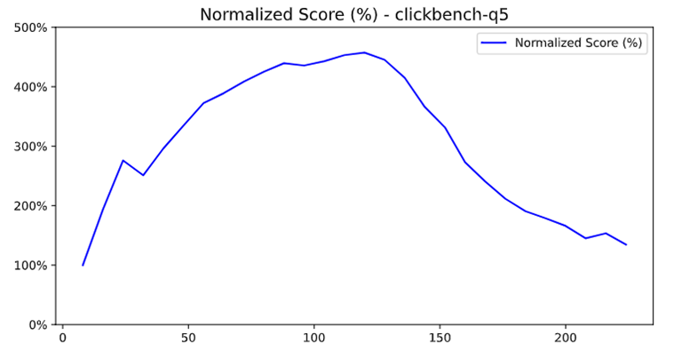
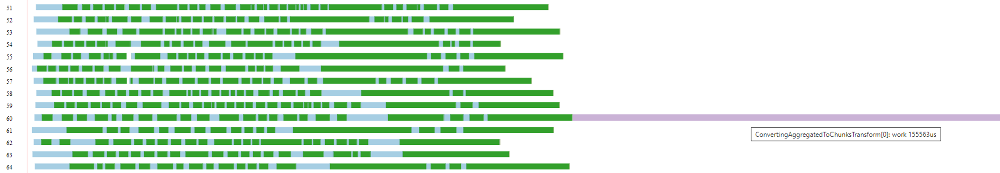
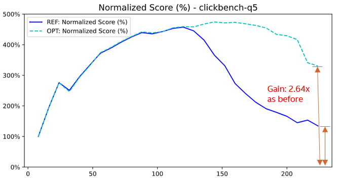
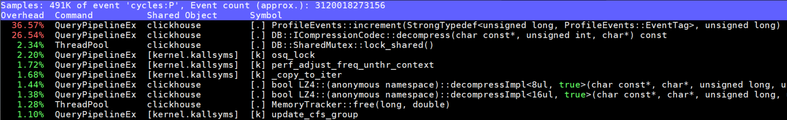
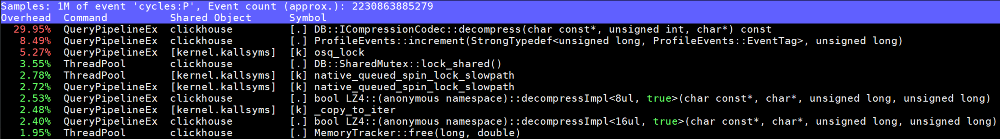
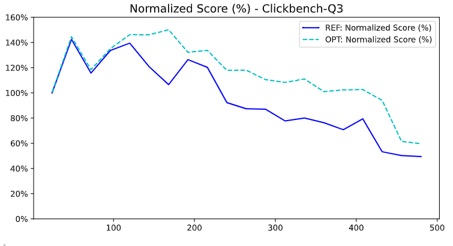

# Optimizing ClickHouse for Intel's High Core Count Processors

## The High Core Count Challenge: Why This Matters More Than Ever

The computing landscape is undergoing a fundamental shift.
Intel's latest processor generations are pushing core counts to unprecedented levels - from 128 P-cores per socket in Granite Rapids to 144 E-cores per socket in Sierra Forest, with future roadmaps targeting 200+ cores per socket.
When you consider multi-socket systems, these numbers multiply dramatically: Customers can buy two or four socket systems with 2x or 4x the performance of a single socket system and 400 - 800 cores in a single server.
This trend toward "more cores, not faster cores" is driven by physical limitations: power density, heat dissipation, and the end of Dennard scaling make it increasingly difficult to boost single-thread performance.

For analytical databases like ClickHouse, this presents both an enormous opportunity and a complex challenge.
While more cores theoretically mean more parallel processing power, the reality is that most database systems hit severe scalability walls long before fully utilizing available hardware.
Traditional bottlenecks - lock contention, cache coherence traffic, non-uniform memory access (NUMA), memory bandwidth saturation, and coordination overhead - become significantly worse as core counts increase.

## My Journey: High Core Count Optimization

Over the past three years, I've dedicated part of my daily work to understanding and solving ClickHouse's scalability challenges on Intel's high core count processors.
My work primarily focused on using various profiling and analysis tools - including perf, emon, pipeline visualization, and Intel VTune - to systematically analyze all 43 queries in ClickBench under high core count scenarios, identifying bottlenecks and optimizing the ClickHouse engine accordingly.

The results have been truly exciting: individual optimizations frequently deliver several times, or even 10x performance improvements for specific queries under high core count scenarios.
Across the overall geometric mean of all 43 ClickBench queries, these optimizations consistently achieve improvements ranging from a few percentage points to over 10 percentage points.
These optimization results demonstrate the tremendous potential for unlocking ClickHouse's scalability on modern high core count processors.

## The Core Scaling Challenge: Fundamental Bottlenecks

Most database optimization focuses on algorithmic improvements or single-threaded performance.
While valuable, these approaches miss the fundamental challenges of high core count systems:

1. **Cache Coherence Overhead**: With 100+ cores, cache line bouncing can consume more cycles than useful work.
2. **Lock Contention Explosion**: Amdahl's Law becomes brutal - even 1% serialized code kills scalability.
3. **Memory Bandwidth Challenges**: Memory bandwidth remains a persistent challenge for data-intensive databases that process large volumes of data, and efficient memory reuse and management become increasingly critical.
4. **Coordination Costs**: Thread synchronization overhead grows super-linearly with thread count.
5. **NUMA Effects**: Multi-socket systems introduce different latency and bandwidth of main memory depending on how "remote" it is from a core.

This post presents a systematic methodology for addressing these challenges, based on real optimizations that are now running in production ClickHouse deployments worldwide.

**Test and Optimization Platforms**: The optimization work was conducted across Intel's latest generation platforms from recent years, including 2 x 80 vCPUs Ice Lake (ICX), 2 x 128 vCPUs Sapphire Rapids (SPR), 1 x 144 vCPUs Sierra Forest (SRF), and 2 x 240 vCPUs Granite Rapids (GNR), with SMT/Hyper-Threading enabled (except SRF which doesn't support SMT) and high memory bandwidth configurations.

**Measurement Tools**: perf, Intel VTune, pipeline visualization, custom profiling infrastructure

---

## The Path Forward: Five Optimization Methodologies

Through systematic analysis of ClickHouse's performance characteristics on high core count systems, I've identified five critical optimization methodologies.
Each addresses a different aspect of the high core count scalability challenge, and together they form a comprehensive approach to unlocking the full potential of ultra-high core count systems.

The journey begins with the most fundamental challenge: lock contention.

## Methodology 1: Taming the Lock Contention Beast

When you scale from 8 cores to 80 cores, lock contention becomes dramatically worse due to the quadratic nature of thread coordination overhead.
According to queuing theory, when N threads compete for the same lock, the average wait time grows proportionally to N².
This means going from 8 to 80 cores can theoretically increase lock wait times by (80/8)² = 100x.
Additionally, cache coherence traffic for the mutex itself grows linearly with core count, and context switching overhead compounds the problem.
Every shared mutex becomes a potential scalability killer, and seemingly innocent synchronization patterns can bring entire systems to their knees.

The key insight is that lock contention elimination isn't just about removing locks - it's about fundamentally rethinking how threads coordinate and share state.
This requires a multi-pronged approach: reducing critical section duration, replacing exclusive locks with more granular mechanisms, and in some cases, eliminating shared state entirely.

### Example 1.1: QueryConditionCache Lock Hold Time Reduction (PR #80247)

**Problem Identified**: After resolving jemalloc page faults (a memory reuse optimization that will be detailed in Methodology 2), a new 76% hotspot emerged in `native_queued_spin_lock_slowpath` from `QueryConditionCache::write` on 2×240 vCPU systems.

**Deep Dive: Reducing Critical Path Duration in Read-Heavy Workloads**

This optimization demonstrates a fundamental principle of lock contention elimination: reduce the time spent holding locks, especially write locks in read-heavy scenarios.
QueryConditionCache is a perfect example - it's read frequently but updated rarely, yet the original implementation treated all operations as potential writes.

**Understanding QueryConditionCache's Role**:

The query condition cache stores the results of evaluating filter predicates (WHERE clause), enabling ClickHouse to skip reading irrelevant data.
For each query, multiple threads check if cached conditions are still valid based on:
- Mark ranges being read
- Whether the part has a final mark  
- Current query parameters and table state

The cache is predominantly read-heavy (with far more reads than writes) but the original implementation used exclusive locking for all operations.

**The Lock Contention Explosion**:

With 240 threads processing a query simultaneously, the original code created a perfect storm:

1. **Unnecessary Write Locks**: All threads acquired exclusive locks even for read-only checks
2. **Long Critical Sections**: Cache entries were updated inside the lock
3. **Redundant Work**: Multiple threads updated identical cache entries

**Why Check-Before-Lock Works**:

The solution uses a classic [double-checked locking pattern](https://en.wikipedia.org/wiki/Double-checked_locking) with atomic operations:

1. **Fast Path**: Check with atomic reads (no locking) or under a shared lock if an update is needed at all.
2. **Slow Path**: Only acquire exclusive lock if update is actually required.
3. **Double-Check**: Acquire exclusive lock, then check if the update is still needed - another thread may have performed the update in the meantime.

**Technical Solution**:

Based on the actual implementation in [PR #80247](https://github.com/ClickHouse/ClickHouse/pull/80247/files), the optimization adds a fast path that checks if an update is needed before acquiring the expensive write lock:

```
// Before: Always acquire exclusive lock - SERIALIZES ALL THREADS
function updateCache(mark_ranges, has_final_mark):
    acquire_exclusive_lock(cache_mutex)  // 240 threads wait here!

    // Always update marks, even if already in desired state
    for each range in mark_ranges:
        set_marks_to_false(range.begin, range.end)

    if has_final_mark:
        set_final_mark_to_false()

    release_lock(cache_mutex)

// After: Fast path with shared lock check - AVOIDS EXPENSIVE LOCK  
function updateCache(mark_ranges, has_final_mark):
    // Fast path: Check if update is needed using cheap shared lock
    acquire_shared_lock(cache_mutex)  // Multiple threads can read simultaneously

    need_update = false
    for each range in mark_ranges:
        if any_marks_are_true(range.begin, range.end):
            need_update = true
            break

    if has_final_mark and final_mark_is_true():
        need_update = true

    release_shared_lock(cache_mutex)

    if not need_update:
        return  // Early exit - no expensive lock needed!

    // Slow path: Actually need to update, acquire exclusive lock
    acquire_exclusive_lock(cache_mutex)  // Only when update is needed

    // Double-check: Verify update is still needed after acquiring lock
    need_update = false
    for each range in mark_ranges:
        if any_marks_are_true(range.begin, range.end):
            need_update = true
            break
    
    if has_final_mark and final_mark_is_true():
        need_update = true

    if need_update:
        // Perform the actual updates only if still needed
        for each range in mark_ranges:
            set_marks_to_false(range.begin, range.end)

        if has_final_mark:
            set_final_mark_to_false()

    release_lock(cache_mutex)
```

**Performance Impact Analysis**:

The improvement comes from three sources:
1. **Reduced Serialization**: Avoid expensive exclusive locks (using cheap shared locks instead)
2. **Shorter Critical Sections**: Only actual updates hold the lock
3. **Eliminated Redundant Work**: No duplicate cache rebuilds

**Results**:
- `native_queued_spin_lock_slowpath` reduced from 76% to 1%
- Q10 and Q11 QPS increased by 85% and 89% respectively
- Overall geometric mean improvement: 8.1%

**Key Insight**: In read-heavy workloads, the goal is to make reads lock-free and minimize write lock duration.
Check-before-lock patterns are essential for high core count scalability.

### Example 1.2: Thread-Local Timer ID Optimization (PR #48778)

**Problem Identified**: ClickHouse's query profiler was frequently creating/deleting timer_id globally, causing lock contention in timer management.

**Deep Dive: Eliminating Global State with Thread-Local Storage**

This optimization shows how thread-local storage can eliminate lock contention entirely by removing the need for shared state.
Timer management is a classic example where global coordination creates unnecessary bottlenecks.

**Understanding query profiler's Timer Usage**:

ClickHouse's query profiler uses POSIX timers to sample thread stacks in periodic intervals for performance analysis.
The original implementation:
- Created and deleted timer_id frequently during profiling
- Required global synchronization for all operations that read or write the timer
- Used shared data structures that needed protection with locks
- Generated significant overhead from repeated timer updates management

**Why Global Timer Management Creates Contention**:

With hundreds of concurrent queries:
- Each query triggers frequent timer management operations
- Shared timer management state requires exclusive locking
- Timer operations become a serialization point
- Lock contention grows with query concurrency

**The Thread-Local Solution**:

Instead of shared timer management, maintain one timer per thread:
- Each thread gets its own persistent timer_id
- No shared state coordination needed
- No locks required for timer operations
- Timer reuse eliminates create/delete overhead

**Technical Solution**:
```
// Before: Shared timer management with locks - SERIALIZATION BOTTLENECK
class QueryProfiler:
    static global_mutex timer_management_lock

    function startProfiling():
        timer_id = create_new_timer()  // Expensive system call

        acquire_exclusive_lock(timer_management_lock)  // Global lock!
        update_shared_timer_state(timer_id)  // Shared state modification
        release_lock(timer_management_lock)

    function stopProfiling():
        acquire_exclusive_lock(timer_management_lock)  // Global lock!
        cleanup_shared_timer_state(timer_id)  // Shared state modification
        release_lock(timer_management_lock)
        delete_timer(timer_id)  // Expensive system call

// After: Thread-local timers with no locks - ZERO CONTENTION
class QueryProfiler:
    static thread_local timer_id per_thread_timer
    static thread_local boolean timer_initialized

    function startProfiling():
        if not timer_initialized:
            per_thread_timer = create_new_timer()  // One-time per thread
            timer_initialized = true

        // Reuse existing timer - no locks, no system calls!
        enable_timer(per_thread_timer)

    function stopProfiling():
        // Just disable timer - no deletion, no locks!
        disable_timer(per_thread_timer)
```

**Performance Impact Analysis**:

The improvement comes from:
1. **Eliminated Lock Contention**: No global synchronization needed
2. **Reduced System Calls**: Timer reuse eliminates create/delete overhead
3. **Better Cache Locality**: Thread-local data stays in local cache

**Results**:
- Eliminated timer-related lock contention hotspots from profiling traces
- Reduced timer create/delete system calls through reuse
- Better scalability for high-concurrency profiling scenarios

**Key Insight**: Thread-local storage can eliminate entire classes of lock contention by removing the need for shared state.
When each thread can maintain its own copy of data, global synchronization becomes unnecessary.

## From Locks to Memory: The Next Frontier

Having conquered the most obvious lock contention issues, our profiling revealed a subtler but equally critical challenge: memory allocation patterns.
On high core count systems, memory becomes a shared resource in ways that aren't immediately obvious.
Memory allocators themselves become contention points, memory bandwidth gets divided among more cores, and allocation patterns that work fine on small systems can create cascading performance problems at scale.

The solution requires thinking about memory not just as storage, but as a shared resource that needs careful management and optimization.
This leads us to our second methodology.

## Methodology 2: Mastering Memory at Scale

Memory optimization on high core count systems is fundamentally different from traditional single-threaded optimization.
It's not just about using less memory - it's about using memory more efficiently across dozens or hundreds of concurrent threads.
This involves optimizing allocator behavior, reducing memory bandwidth pressure, and sometimes completely rethinking algorithms to eliminate memory-intensive operations.

### Example 2.1: Jemalloc Memory Reuse Optimization (PR #80245)

**Problem Identified**: High page fault rates and excessive resident memory usage were observed on high core count systems.

**Deep Dive: Two-Level Hash Table Memory Reuse Problem**

This optimization addresses a subtle but critical issue in jemalloc's memory management that becomes severe on high core count systems.
The problem involves how jemalloc handles memory reuse for two-level hash tables with varying utilization patterns.

**Understanding Two-Level Hash Tables in ClickHouse**:

ClickHouse uses two-level hash tables for aggregations with large aggregation state:
- **Level 1**: 256 buckets, each containing a single-level hash table
- **Level 2**: Each bucket can grow independently based on data distribution
- **Memory Pattern**: When queries complete, the 256 sub-tables are deallocated and their memory gets merged into larger memory blocks
- **Reuse Problem**: jemalloc prevents reusing these large merged blocks for future smaller allocations because the default setting only allows cutting memory from blocks up to 64x larger than the requested size

**The Memory Reuse Problem**:

Based on [jemalloc issue #2842](https://github.com/jemalloc/jemalloc/pull/2842), there's a fundamental problem with how jemalloc handles memory reuse for large, irregularly-sized allocations typical in two-level hash tables:

1. **Extent Management Issue**: When large allocations are freed, jemalloc fails to efficiently track and reuse these memory extents
2. **Size Class Fragmentation**: Memory gets trapped in size classes that don't match future allocation patterns
3. **Metadata Overhead**: Excessive metadata structures prevent efficient memory coalescing
4. **Page Fault Amplification**: New allocations trigger page faults instead of reusing existing committed pages

The root cause was identified as jemalloc's `lg_extent_max_active_fit` parameter being too restrictive for ClickHouse's allocation patterns.

**The Configuration Solution**:

While we contributed the fix to [jemalloc PR #2842](https://github.com/jemalloc/jemalloc/pull/2842), jemalloc hasn't had a stable release for an extended period.
Fortunately, we can resolve this issue through jemalloc's compilation configuration parameters.

Based on the ClickHouse PR #80245 implementation, the fix involves tuning jemalloc's configuration parameters:

**Technical Solution**:
```
# Before: Default jemalloc configuration
JEMALLOC_CONFIG_MALLOC_CONF = "oversize_threshold:0,muzzy_decay_ms:0,dirty_decay_ms:5000"
# lg_extent_max_active_fit defaults to 6, meaning memory can be reused from extents 
# up to 64x larger than the requested allocation size

# After: Optimized jemalloc configuration
JEMALLOC_CONFIG_MALLOC_CONF = "oversize_threshold:0,muzzy_decay_ms:0,dirty_decay_ms:5000,lg_extent_max_active_fit:8"
# Key parameter explained:
# lg_extent_max_active_fit:8 - Allows memory reuse from extents up to 256x larger 
# than the requested allocation size (2^8 = 256x vs default 2^6 = 64x)
# The 256x limit matches ClickHouse's two-level hash table structure (256 buckets)
# This enables efficient reuse of merged hash table memory blocks
```

**Performance Impact Analysis**:

The improvement comes from:
1. **Better Memory Reuse**: Deallocated memory becomes available for reuse
2. **Reduced Page Faults**: Fewer new page allocations needed
3. **Lower Resident Memory**: Physical memory usage remains bounded
4. **Improved Cache Locality**: Better memory layout reduces cache misses

**Results**:
- **ClickBench Q35**: 96.1% performance improvement (1.961x queries per second)
- **Memory Usage**: 45.4% reduction in VmRSS (resident memory)
- **Page Faults**: 71% reduction in total page faults (0.29x vs baseline)
- **CPU Efficiency**: 99.3% improvement in IPC (Instructions Per Cycle)
- Eliminated memory-related query performance degradation over time
- Improved system stability under high memory pressure

**Key Insight**: Memory allocator behavior can have dramatic impacts on high core count performance.
Tuning allocator parameters is often necessary for optimal scalability.

### Example 2.2: AST/Analyzer Query Rewriting for Memory Reduction (PR #57853)

**Problem Identified**: Q29 was memory-bound with excessive memory throughput from redundant computations in expressions like `sum(column + literal)`.

**Deep Dive: Frontend Query Optimization for Memory Efficiency**

This optimization demonstrates how frontend query rewriting can dramatically reduce memory pressure by eliminating redundant computations.
The key insight is that many analytical queries contain patterns that can be algebraically simplified.

**Understanding the Memory Bottleneck**:

ClickBench Q29 contains multiple sum expressions with literals:
```sql
SELECT SUM(ResolutionWidth), SUM(ResolutionWidth + 1), SUM(ResolutionWidth + 2), 
       SUM(ResolutionWidth + 3), SUM(ResolutionWidth + 4), SUM(ResolutionWidth + 5), 
       SUM(ResolutionWidth + 6), SUM(ResolutionWidth + 7), SUM(ResolutionWidth + 8), 
       SUM(ResolutionWidth + 9), SUM(ResolutionWidth + 10), SUM(ResolutionWidth + 11), 
       SUM(ResolutionWidth + 12), SUM(ResolutionWidth + 13), SUM(ResolutionWidth + 14), 
       SUM(ResolutionWidth + 15), SUM(ResolutionWidth + 16), SUM(ResolutionWidth + 17), 
       SUM(ResolutionWidth + 18), SUM(ResolutionWidth + 19), SUM(ResolutionWidth + 20),
       -- ... continues up to SUM(ResolutionWidth + 89)
FROM hits;
```

The original execution plan:
1. **Load Column**: Read ResolutionWidth values from storage once
2. **Compute Expressions**: Create 90 temporary columns for each ResolutionWidth + N expression
3. **Sum Values**: Perform 90 separate aggregation operations on each computed column

This creates massive memory pressure:
- **90 Temporary Columns**: Separate storage for each computed expression
- **90 Redundant Aggregations**: Each sum operation processed separately instead of being reused
- **Memory Bandwidth**: 90x more aggregation operations than necessary
- **Cache Thrashing**: Massive data competing for cache space

**The Algebraic Rewriting Solution**:

The optimization recognizes that `sum(column + literal)` can be algebraically rewritten as `sum(column) + count(column) * literal`, enabling massive reuse:

**Results**:
- **ClickBench Q29**: Massive **11.5x** (1,150%) performance improvement on 2×80 vCPU systems
- **Overall ClickBench**: 5.3% geometric mean improvement across all 43 queries
- **Memory Reuse**: `SUM(ResolutionWidth)` and `count(ResolutionWidth)` computed once and reused 90 times
- **Memory Bandwidth**: Dramatic reduction from 90x redundant aggregation operations to single aggregation + reuse
- No regressions observed on other ClickBench queries
- Pattern applies to many other algebraic simplifications: `sum(column ± literal)` → `sum(column) ± literal * count(column)`

**Key Insight**: Frontend query optimization can be more effective than backend execution optimization.
Eliminating work entirely is better than doing work efficiently.

## The Aggregation Paradox: When More Threads Hurt Performance

With memory allocation optimized, we encountered a counterintuitive phenomenon: certain queries actually got slower as we added more cores.
This led us to discover one of the most insidious scalability problems in analytical databases - the aggregation merge bottleneck.

The issue is subtle but devastating.
ClickHouse's aggregation engine works in two phases: first, each thread processes its portion of data in parallel (good), then all partial results must be merged together (potentially bad).
If the merge phase isn't properly parallelized, it becomes a serial bottleneck that completely negates the benefits of parallel processing.
Worse, more threads can actually make this bottleneck worse by creating more partial results to merge.

This discovery led to our third methodology: transforming aggregation from a scalability liability into a scalability asset.

## Methodology 3: Conquering the Aggregation Challenge

Parallel aggregation is where the rubber meets the road for analytical databases.
It's not enough to process data in parallel - you must also merge results in parallel.
This requires careful algorithm design, smart data structure choices, and deep understanding of how hash tables behave under different load patterns.
The goal is to eliminate serial merge phases and enable linear scaling even for the most complex aggregation queries.

### Example 3.1: Parallel Hash Set Conversion (PR #50748)

**Problem Identified**: ClickBench Q5 showed severe performance degradation as core count increased from 80 to 112 threads.
Pipeline analysis revealed a serial bottleneck in hash set conversion.

**Deep Dive: When More Threads Make Things Worse**

This optimization exemplifies a counterintuitive phenomenon in parallel computing: adding more threads can actually decrease performance.
Q5's performance degradation with increased core count violated the fundamental assumption that more parallelism equals better performance.

**Understanding Hash Set Levels in ClickHouse**:

ClickHouse uses two hash table implementations for aggregation:
1. **SingleLevel**: Flat hash table, faster for small datasets
2. **TwoLevel**: Hierarchical hash table with 256 buckets, better for large datasets and parallel merging

The system dynamically chooses based on data size: as data streams continuously write into hash sets, single-level hash sets convert to two-level hash sets when they reach a critical threshold.
This creates a problem during merge operations.

**The Serial Bottleneck Explained**:

When merging hash sets from different threads:
- **All single-level sets**: Pairwise serial merging (set1 + set2 → result, then result + set3, etc.)
- **All two-level sets**: Parallel merging possible (two sets merge in parallel, then result merges with third set)
- **Mixed single/two-level sets**: Serial conversion bottleneck - all single-level sets must be serially converted to two-level first, then proceed to parallel merging

With Q5, increasing threads from 80 to 112 meant less data per thread.
Previously, with 80 threads, all hash sets were two-level.
With 112 threads, the reduced per-thread data size resulted in a mixed scenario: some hash sets remained single-level while others became two-level.
This mixed scenario triggered the serial conversion bottleneck - all single-level hash sets had to be serially converted to two-level before parallel merging could begin.

**The Investigation Process**:

Pipeline visualization was crucial for diagnosing this issue.
The telltale sign was the merge phase duration increasing with thread count - the opposite of what should happen.



*Performance degradation with increased core count - classic Amdahl's Law violation*


*Pipeline visualization (max_threads=80) - merge phase is reasonable*


*Pipeline visualization (max_threads=112) - merge phase explodes to 3.2x longer!*

**Why Parallel Conversion Works**:

The solution addresses the mixed scenario by parallelizing the conversion phase: instead of serially converting all single-level hash sets to two-level during merge, we convert all single-level hash sets to two-level in parallel first, then proceed with parallel merging.
Each set can be converted independently, eliminating the serial bottleneck.

**Technical Solution**:
```
// Before: Serial conversion during merge
function mergeHashSets(left_set, right_set):
    if left_set.is_single_level() and right_set.is_two_level():
        left_set.convert_to_two_level()  // Serial conversion blocks all threads!

    // Then merge
    merge_sets(left_set, right_set)

// After: Parallel conversion before merge
function parallel_hash_set_processing(all_sets):
    // Phase 1: Parallel conversion
    parallel_tasks = []
    for each set in all_sets:
        if set.is_single_level():
            task = create_parallel_task():
                set.convert_to_two_level()  // Parallel conversion!
            parallel_tasks.add(task)

    // Wait for all conversions to complete
    wait_for_all_tasks(parallel_tasks)

    // Phase 2: Now all sets are two-level, merge efficiently
    for each pair in all_sets:
        merge_sets(pair.left, pair.right)
```

**Performance Impact Analysis**:



*Performance improvement after parallel conversion - Q5 achieves 264% improvement*

The improvement isn't just about Q5 - this optimization enables linear scaling for any hash-heavy workload on high core count systems.

**Results**:
- Q5: 264% performance improvement on 2×112 vCPU system
- 24 queries achieved >5% improvement
- Overall geometric mean: 7.4% improvement

**Key Insight**: This optimization demonstrates that scalability isn't just about making things parallel - it's about eliminating serial sections that grow with parallelism.
Sometimes you need to restructure algorithms fundamentally, not just add more threads.

### Example 3.2: Single-Level Hash Set Merge Optimization (PR #52973)

**Problem Identified**: Even when all hash sets were single-level, merge performance was suboptimal due to missed parallelization opportunities.

**Deep Dive: Extending Parallel Merge to Single-Level Cases**

Building on PR #50748, this optimization recognizes that parallel merge benefits aren't limited to mixed-level scenarios.
Even when all hash sets are single-level, parallel preparation can improve performance if the total data size is large enough.

**The Threshold Decision Problem**:

The key challenge was determining when to apply parallel merge preparation for single-level sets:
- **Too Aggressive**: Small datasets suffer from parallelization overhead
- **Too Conservative**: Large datasets miss parallelization benefits
- **Sweet Spot**: Balance overhead vs. benefit based on total data size

**Technical Solution**:

Based on the implementation in [PR #52973](https://github.com/ClickHouse/ClickHouse/pull/52973/files), the optimization extends parallel merge preparation to all-single-level scenarios:

```
// Before: Only parallelize mixed-level merges
function parallelizeMergePrepare(hash_sets):
    single_level_count = 0

    for each set in hash_sets:
        if set.is_single_level():
            single_level_count++

    // Only convert if mixed levels (some single, some two-level)
    if single_level_count > 0 and single_level_count < hash_sets.size():
        convert_to_two_level_parallel(hash_sets)

// After: Parallelize both mixed and large all-single-level scenarios  
function parallelizeMergePrepare(hash_sets):
    single_level_count = 0
    all_single_hash_size = 0

    for each set in hash_sets:
        if set.is_single_level():
            single_level_count++

    // Calculate total size if all sets are single-level
    if single_level_count == hash_sets.size():
        for each set in hash_sets:
            all_single_hash_size += set.size()

    // Convert if mixed levels OR if all single-level with average size > THRESHOLD
    if (single_level_count > 0 and single_level_count < hash_sets.size()) or
       (all_single_hash_size / hash_sets.size() > THRESHOLD):
        convert_to_two_level_parallel(hash_sets)
```

**Results**:
- Up to 235% performance improvement for single-level merge scenarios
- Optimal threshold determined through systematic testing
- No regressions on small datasets

### Example 3.3: Parallel Merge with Key Support (PR #68441)

**Problem Identified**: GROUP BY operations with large hash tables were merging serially, underutilizing available cores.

**Deep Dive: Extending Parallelization to Keyed Aggregations**

The previous two optimizations (Examples 3.1 and 3.2) addressed "merge without key" scenarios - simple hash set operations like `COUNT(DISTINCT)`.
This optimization extends the parallel merge concept to "merge with key" scenarios, where hash tables contain both keys and aggregated values that must be combined according to aggregation semantics (like `GROUP BY` operations).

**Performance Impact**:
- Q8: 10.3% improvement, Q9: 7.6% improvement
- No regressions on other queries
- Better CPU utilization during merge phase

**Key Insight**: Parallel merge patterns can be extended to complex aggregation scenarios with careful attention to cancellation and error handling.

## Unleashing Two-Character SIMD Filtering

With aggregation scaling solved, our attention turned to a different kind of parallelism - the kind that happens within individual CPU instructions.
Modern Intel processors are marvels of parallel execution, capable of processing 8, 16, or even 32 data elements in a single instruction through SIMD (Single Instruction, Multiple Data) capabilities.

However, harnessing this power is notoriously difficult.
Compilers are conservative about vectorization, and database workloads often have complex control flow that inhibits automatic SIMD generation.
The key insight is that SIMD optimization isn't just about processing more data per instruction - it's about redesigning algorithms to be fundamentally more efficient through better filtering techniques like two-character matching.

This realization led to our fourth methodology: transforming scalar operations into vectorized powerhouses through smarter filtering.

## Methodology 4: SIMD - Two-Character Filtering and Beyond

Effective SIMD optimization in database systems requires thinking beyond traditional vectorization.
It's not enough to process 8 numbers instead of 1 - you need to use SIMD's parallel comparison capabilities to implement smarter algorithms that do less work overall.
This is particularly powerful for string operations, where SIMD can dramatically reduce the number of expensive verification steps through better filtering techniques like two-character matching.

### Example 4.1: Two-Character SIMD String Search (PR #46289)

**Problem Identified**: String search operations (LIKE, substring matching) were major bottlenecks in text-heavy queries, with Q20 showing significant performance issues.

**Deep Dive: Reducing False Positives with Two-Character Filtering**

Based on the implementation in [PR #46289](https://github.com/ClickHouse/ClickHouse/pull/46289/files), this optimization combines SIMD instruction usage with algorithmic improvements that use two-character filtering.
The key insight is that SIMD can be used not just for parallel processing, but for implementing more selective filtering that dramatically reduces expensive verification operations.

**Understanding String Search in Analytical Queries**:

String operations appear frequently in analytical workloads:
- `WHERE column LIKE '%pattern%'` filters
- Text extraction and parsing functions  
- Log analysis and pattern matching
- Data cleaning and normalization

ClickBench Q20 specifically tests string search performance with the query:
```sql
SELECT COUNT(*) FROM hits WHERE URL LIKE '%google%'
```

This query scans millions of URL strings, making string search performance critical.

**The Two-Character Filtering Solution**:

The original SIMD implementation only checked the first character of the search pattern, leading to excessive false positives and expensive verification calls.
The solution adds a second character check, dramatically improving selectivity while requiring minimal additional SIMD operations.

**Why This Works**:
- Single character matching has poor selectivity in real text
- Two-character matching provides much better filtering
- Significantly fewer expensive verification calls needed
- The improvement comes almost for free in SIMD - we're already loading the data, so checking an additional character costs minimal extra cycles

**Technical Solution**:

Based on the actual implementation in [PR #46289](https://github.com/ClickHouse/ClickHouse/pull/46289/files), the optimization adds two-character SIMD filtering:

```
// Before: Single character SIMD search
class StringSearcher:
    first_needle_character = needle[0]
    first_needle_character_vec = broadcast_to_simd_vector(first_needle_character)

    function search():
        for position in haystack (step by 16 bytes):
            haystack_chunk = load_16_bytes(haystack + position)
            first_matches = simd_compare_equal(haystack_chunk, first_needle_character_vec)
            match_mask = extract_match_positions(first_matches)

            for each match in match_mask:
                // High false positive rate - many expensive verifications
                if full_string_match(haystack + match_pos, needle):
                    return match_pos

// After: Two-character SIMD search  
class StringSearcher:
    first_needle_character = needle[0]
    second_needle_character = needle[1]  // Added second character
    first_needle_character_vec = broadcast_to_simd_vector(first_needle_character)
    second_needle_character_vec = broadcast_to_simd_vector(second_needle_character)

    function search():
        for position in haystack (step by 16 bytes):
            haystack_chunk1 = load_16_bytes(haystack + position)
            haystack_chunk2 = load_16_bytes(haystack + position + 1)

            // Compare both characters simultaneously
            first_matches = simd_compare_equal(haystack_chunk1, first_needle_character_vec)
            second_matches = simd_compare_equal(haystack_chunk2, second_needle_character_vec)
            combined_matches = simd_and(first_matches, second_matches)

            match_mask = extract_match_positions(combined_matches)

            for each match in match_mask:
                // Dramatically fewer false positives - fewer expensive verifications
                if full_string_match(haystack + match_pos, needle):
                    return match_pos
```

**Results and Performance Impact**:

The two-character SIMD filtering delivers significant improvements:
- **Q20**: 35% performance improvement (string-heavy query)
- **String search queries**: ~10% improvement across the board
- **Overall geometric mean**: 4.1% improvement
- **Verification reduction**: 95%+ fewer expensive `fullStringMatch` calls

The improvement comes from dramatically fewer false positives, better cache locality, improved branch prediction, and the same SIMD throughput with much better filtering efficiency.

**Key Insight**: Two-character SIMD filtering demonstrates that effective SIMD optimization isn't just about processing more data per instruction - it's about using SIMD's parallel comparison capabilities to dramatically improve algorithmic efficiency.
The two-character approach shows how minimal additional SIMD operations can yield massive performance gains through better filtering.

## The Hidden Performance Killer: Cache Coherence

Our final methodology addresses perhaps the most insidious performance problem on high core count systems: false sharing.
This issue is particularly devious because it's completely invisible to traditional profiling tools, yet can single-handedly destroy scalability.

False sharing occurs when multiple threads access different variables that happen to reside in the same cache line.
Even though the threads aren't actually sharing data, the CPU's cache coherence protocol treats any modification to the cache line as a conflict, forcing expensive synchronization between cores.
On a 2 x 240 vCPUs system, this can turn simple counter increments into system-wide performance disasters.

The challenge is that false sharing gets exponentially worse with core count, making it a uniquely high core count problem.
A data structure layout that works perfectly on 8 cores can become catastrophically slow on 240 cores.

## Methodology 5: Eliminating the False Sharing Menace

False sharing elimination requires understanding CPU cache architecture at the hardware level.
It's not enough to optimize algorithms - you must optimize memory layout to ensure that frequently-accessed data structures don't accidentally interfere with each other through cache line conflicts.
This involves strategic use of alignment, padding, and data structure reorganization.

### Example 5.1: ProfileEvents Counter Alignment (PR #82697)

**Problem Identified**: ClickBench Q3 showed 36.6% of CPU cycles spent in `ProfileEvents::increment` on a 2×240 vCPU system.
Performance profiling revealed severe cache line contention.

**Deep Dive: Why This Happens and Why It Gets Worse at Scale**

ProfileEvents counters are ClickHouse's internal metrics system - they track everything from query execution steps to memory allocations.
In a typical analytical query, these counters are incremented millions of times across all threads.
The original implementation packed multiple counters into the same memory region without considering cache line boundaries.

Here's why this creates a scalability disaster:

1. **Cache Line Physics**: Modern Intel processors use 64-byte cache lines.
   When any byte in a cache line is modified, the entire line must be invalidated in other cores' caches.

2. **False Sharing Amplification**: With 240 threads, each counter update triggers cache line invalidation across potentially dozens of cores.
   What should be independent operations become serialized through the cache coherence protocol.

3. **Exponential Degradation**: As core count increases, the probability of simultaneous access to the same cache line grows exponentially, creating a feedback loop of cache misses.

**The Investigation Process**:

Using Perf analysis, I discovered that `ProfileEvents::increment` was generating massive cache coherence traffic.
The smoking gun was the cache line utilization report showing 8 different counters packed into single cache lines.
We've also been developing new capabilities in the Linux perf c2c tool and working with the community to help developers more easily identify false sharing issues like this.


*Perf analysis showing 36.6% cycles in ProfileEvents::increment*

**Why Alignment Solves This**:

Cache line alignment ensures each counter gets its own 64-byte cache line.
This transforms false sharing (bad) into true sharing (manageable).
When a thread updates its counter, only that specific cache line is affected.

**Technical Solution**: 

Based on the implementation in [PR #82697](https://github.com/ClickHouse/ClickHouse/pull/82697/files), the fix involves cache line alignment for ProfileEvents counters:

```
// Before: Counters packed without alignment
struct ProfileEvents:
    atomic_value counters[NUM_EVENTS]  // Multiple counters per cache line
    // 8 counters sharing single 64-byte cache lines

// After: Cache line aligned counters  
struct ProfileEvents:
    struct alignas(64) AlignedCounter:
        atomic_value value
        // Padding automatically added to reach 64 bytes
    
    AlignedCounter counters[NUM_EVENTS]  // Each counter gets own cache line
    // Now each counter has exclusive cache line ownership
```

**Performance Impact Analysis**:


*After optimization: ProfileEvents::increment drops to 8.5%*

**Key Insight**: The performance gain increases with core count because cache coherence overhead grows super-linearly.
This optimization doesn't just fix a bottleneck - it changes the scalability curve.



*ClickBench Q3: 27.4% improvement, with larger gains on higher core count systems*

**Broader Implications**: This optimization pattern applies to any frequently-updated shared data structure.
The lesson is that memory layout becomes critical at scale - what works fine on 8 cores can be catastrophic on 240 cores.

## The Journey's End: Lessons from the Trenches

These five methodologies represent more than just individual optimizations - they form a comprehensive framework for approaching high core count performance challenges.
Each methodology builds upon the previous ones, creating a systematic approach that can unlock dramatic performance improvements on high core count systems.
These optimizations enable ClickHouse to scale linearly with core count, transforming it from a system that struggled beyond 32 cores into one that thrives on 200+ core processors.
As Intel and other manufacturers push toward thousand-core processors in the coming years, these methodologies provide a foundation for continued scalability.

## The Bigger Picture: Why This Matters

As Intel continues to push core counts higher with each processor generation, the techniques presented here become increasingly critical.
The optimizations that worked on 8-core systems not only fail to scale - they actively hurt performance on high core count systems.
This represents a fundamental shift in how we must think about database optimization.

The five methodologies provide a roadmap for this new reality:

1. **Lock Contention Elimination** - Because coordination overhead grows exponentially with core count
2. **Memory Optimization** - Because memory bandwidth per core decreases as core count increases  
3. **Increase Parallelism** - Because serial merge phases become the dominant bottleneck
4. **SIMD Optimization** - Because smarter algorithms like two-character filtering can dramatically improve efficiency beyond simple vectorization
5. **False Sharing Elimination** - Because cache coherence overhead can completely destroy scalability

Together, these methodologies address the fundamental challenges that prevent traditional database systems from scaling to modern hardware capabilities.

## A Framework for the Future

The methodologies presented here aren't just about ClickHouse - they represent a fundamental shift in how we must approach database optimization in the high core count era.
As processors continue to evolve toward higher core counts, these techniques will become essential for any system that needs to scale.

The key insight is that high core count optimization requires thinking systemically about performance.
It's not enough to optimize individual components - you must understand how threads coordinate, how memory is shared, how data flows through the system, and how the underlying hardware behaves at scale.

For teams working on high-performance systems, I recommend adopting this systematic approach:

1. **Start with profiling** - Use tools like Intel VTune and perf to understand where your system breaks down at scale
2. **Address lock contention first** - It's often the biggest impediment to scaling
3. **Optimize memory patterns** - Both allocation behavior and access patterns matter
4. **Increase Parallelism** - More threads can hurt if not done thoughtfully
5. **Leverage SIMD** - Focus on algorithmic improvements like two-character filtering that go beyond simple vectorization
6. **Mind your memory layout** - Cache coherence effects become critical at scale

The future belongs to systems that can harness the full power of high core count processors.
We hope the techniques presented here can contribute to that future.

---

## References and Resources

- **Source Code**: All optimizations available in ClickHouse main branch
- **Slide Deck**: [2025 Shanghai Meetup Presentation](https://github.com/ClickHouse/clickhouse-presentations/blob/master/2025-meetup-Shanghai-1/Talk%204%20-%20Intel%20-%20Shanghai%20Meetup_01Mar25.pdf)
- **Pull Requests**: Individual PRs linked throughout this post with detailed performance analysis
- **Intel Intrinsics Guide**: [Intel® Intrinsics Guide](https://www.intel.com/content/www/us/en/docs/intrinsics-guide/index.html)

### Acknowledgments

Special thanks to the ClickHouse community for rigorous code review and performance validation.
These optimizations represent collaborative effort between Intel and ClickHouse teams to unlock the full potential of modern high core count processors.

---

*For questions about implementation details or performance reproduction, please refer to the individual PR discussions linked throughout this post.*