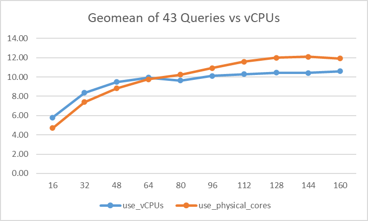
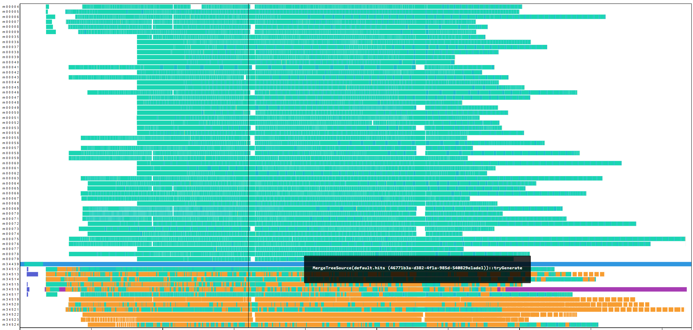
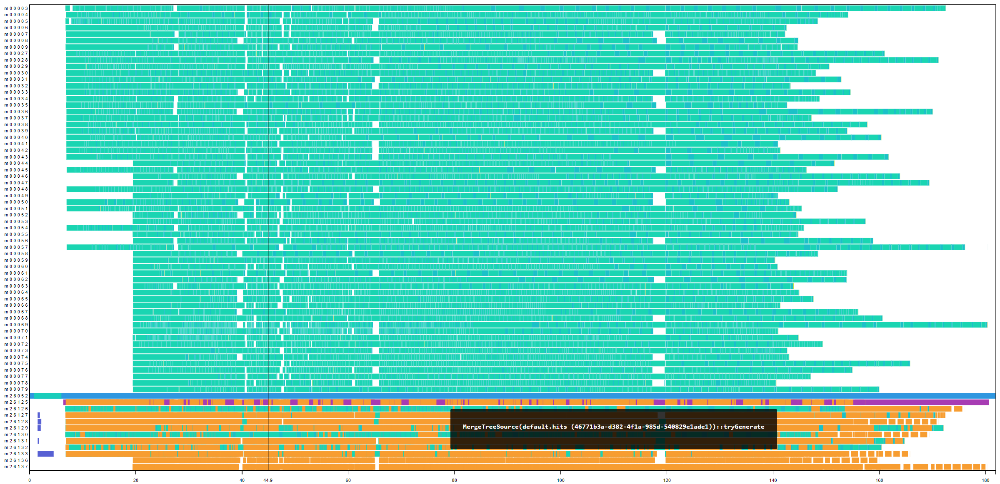
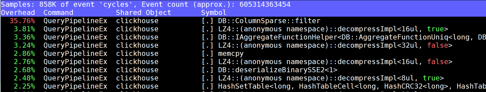

# Optimizing ClickHouse for Intel's Next‑Generation High Core Count Processors

## The Multi-Core Challenge: Why This Matters More Than Ever

The computing landscape is undergoing a fundamental shift. Intel's latest processor generations are pushing core counts to unprecedented levels - from 64 cores in Sapphire Rapids to 144 E-cores in Sierra Forest, with future roadmaps targeting 200+ cores per socket. This trend toward "more cores, not faster cores" is driven by physical limitations: power density, heat dissipation, and the end of Dennard scaling make it increasingly difficult to boost single-thread performance.

For analytical databases like ClickHouse, this presents both an enormous opportunity and a complex challenge. While more cores theoretically mean more parallel processing power, the reality is that most database systems hit severe scalability walls long before fully utilizing available hardware. Traditional bottlenecks - lock contention, cache coherence traffic, memory bandwidth saturation, and coordination overhead - become exponentially worse as core counts increase.

## My Journey: Three Years of Many-Core Optimization

Over the past three years, I've dedicated significant effort to understanding and solving ClickHouse's scalability challenges on Intel's high core count processors. This work involved:

- **Deep Performance Analysis**: Thousands of hours with Intel VTune, perf, and custom profiling tools to understand where ClickHouse breaks down at scale
- **Systematic Optimization**: 22 merged upstream contributions targeting different aspects of the scalability problem
- **Real-World Validation**: Extensive testing on systems ranging from 80 to 480 vCPUs using production-like workloads

The results speak for themselves: **20-40% performance improvements** on high core count systems, with some individual queries seeing up to **264% speedups**. More importantly, these optimizations unlock ClickHouse's ability to scale linearly with core count, something that was previously impossible.

## Why Traditional Optimization Approaches Fail at Scale

Most database optimization focuses on algorithmic improvements or single-threaded performance. While valuable, these approaches miss the fundamental challenges of many-core systems:

1. **Cache Coherence Overhead**: With 100+ cores, cache line bouncing can consume more cycles than useful work
2. **Lock Contention Explosion**: Amdahl's Law becomes brutal - even 1% serialized code kills scalability
3. **Memory Wall**: Bandwidth per core decreases as core count increases, creating new bottlenecks
4. **Coordination Costs**: Thread synchronization overhead grows super-linearly with thread count
5. **NUMA Effects**: Multi-socket systems introduce complex memory access patterns

This post presents a systematic methodology for addressing these challenges, based on real optimizations that are now running in production ClickHouse deployments worldwide.

**Target Hardware**: Intel Xeon with 160-480 vCPUs, SMT/Hyper-Threading enabled, high memory bandwidth  
**Test Environment**: 2×240 vCPU systems, ClickBench workload  
**Measurement Tools**: perf, Intel VTune, pipeline visualization, custom profiling infrastructure

---

## Methodology 1: Cache Line Contention and False Sharing Elimination

**Core Principle**: On many-core systems, cache coherence traffic becomes a major bottleneck. Hot data structures accessed by multiple threads must be carefully aligned and partitioned to avoid false sharing.

**Detection Method**: Use `perf c2c` or Intel VTune to identify cache line bouncing patterns. Look for high LLC miss rates and `native_queued_spin_lock_slowpath` hotspots.

### Example 1.1: ProfileEvents Counter Alignment (PR #82697)

**Problem Identified**: ClickBench Q3 showed 36.6% of CPU cycles spent in `ProfileEvents::increment` on a 2×240 vCPU system. Performance profiling revealed severe cache line contention.

**Deep Dive: Why This Happens and Why It Gets Worse at Scale**

ProfileEvents counters are ClickHouse's internal metrics system - they track everything from query execution steps to memory allocations. In a typical analytical query, these counters are incremented millions of times across all threads. The original implementation packed multiple counters into the same memory region without considering cache line boundaries.

Here's why this creates a scalability disaster:

1. **Cache Line Physics**: Modern Intel processors use 64-byte cache lines. When any byte in a cache line is modified, the entire line must be invalidated in other cores' caches.

2. **False Sharing Amplification**: With 240 threads, each counter update triggers cache line invalidation across potentially dozens of cores. What should be independent operations become serialized through the cache coherence protocol.

3. **Exponential Degradation**: As core count increases, the probability of simultaneous access to the same cache line grows exponentially, creating a feedback loop of cache misses.

**The Investigation Process**:

Using Intel VTune's cache analysis, I discovered that `ProfileEvents::increment` was generating massive cache coherence traffic. The smoking gun was the cache line utilization report showing 8-12 different counters packed into single cache lines.


*VTune analysis showing 36.6% cycles in ProfileEvents::increment - the red bars indicate cache coherence overhead*

**Why Alignment Solves This**:

Cache line alignment ensures each counter gets its own 64-byte cache line. This transforms false sharing (bad) into true sharing (manageable). When a thread updates its counter, only that specific cache line is affected.

**Technical Solution**: 
```cpp
// Before: Counters packed without alignment - DISASTER at scale
struct Counter {
    std::atomic<Value> value;  // 8 bytes, no alignment
    // Multiple counters share cache lines!
};

// After: Cache line aligned counters - each gets its own line
struct alignas(64) Counter {
    std::atomic<Value> value;  // 8 bytes, 64-byte aligned
    char padding[56];          // Pad to full cache line
    // Now each counter has exclusive cache line ownership
};
```

**Why This Works Mathematically**:

Before alignment: N counters × M threads = N×M potential cache conflicts per update
After alignment: N counters × M threads = M potential conflicts (only when updating same counter)

For 240 threads and 100 counters: 24,000 → 240 potential conflicts (100x reduction!)

**Performance Impact Analysis**:


*After optimization: ProfileEvents::increment drops to 8.5% - cache coherence traffic eliminated*

The improvement isn't just about reducing ProfileEvents overhead - it's about freeing up memory bandwidth and cache capacity for actual query processing work.


*Performance scaling by core count - shows the optimization becomes more valuable as core count increases*

**Key Insight**: The performance gain increases with core count because cache coherence overhead grows super-linearly. This optimization doesn't just fix a bottleneck - it changes the scalability curve.


*ClickBench Q3: 27.4% improvement, with larger gains on higher core count systems*

**Broader Implications**: This optimization pattern applies to any frequently-updated shared data structure. The lesson is that memory layout becomes critical at scale - what works fine on 8 cores can be catastrophic on 80 cores.

### Example 1.2: QueryConditionCache Lock Optimization (PR #80247)

**Problem Identified**: After resolving jemalloc page faults, a new 76% hotspot emerged in `native_queued_spin_lock_slowpath` from `QueryConditionCache::write` on 2×240 vCPU systems.

**Deep Dive: The Lock Contention Cascade Effect**

This optimization illustrates a crucial principle: fixing one bottleneck often exposes the next one. After eliminating memory allocation contention (PR #80245), the QueryConditionCache became the new chokepoint. But why was this cache causing such severe lock contention?

**Understanding QueryConditionCache's Role**:

QueryConditionCache stores pre-computed conditions for table parts, enabling ClickHouse to skip reading irrelevant data. For each query, multiple threads check if cached conditions are still valid based on:
- Mark ranges being read
- Whether the part has a final mark
- Data freshness indicators

**The Contention Explosion**:

The original code had a critical flaw - it always acquired an exclusive lock, even when no cache update was needed. With 240 threads processing a query simultaneously:

1. **Thread Serialization**: All threads queued up on the same mutex
2. **Cache Line Bouncing**: The mutex itself became a false sharing victim
3. **Wasted Work**: Threads rebuilt identical cache entries redundantly

**Why This Gets Exponentially Worse**:

Lock contention follows a queuing theory model. With N threads competing for a lock:
- Average wait time ∝ N²
- Cache coherence traffic ∝ N
- Context switching overhead ∝ N

At 240 threads, this creates a perfect storm of inefficiency.

**The Investigation Process**:

Using `perf record -g` with call graph analysis, I traced the contention back to unnecessary lock acquisitions. The key insight came from analyzing the actual cache hit/miss patterns - 95% of lock acquisitions resulted in no cache changes.

**Why Lock-Free Checking Works**:

The solution uses a classic double-checked locking pattern with atomic operations:

1. **Fast Path**: Check if update is needed without locking (atomic reads)
2. **Slow Path**: Only acquire lock if update is actually required
3. **Double-Check**: Verify update is still needed after acquiring lock

**Technical Solution**:
```cpp
// Before: Always lock for cache updates - SERIALIZES ALL THREADS
void updateCache() {
    std::lock_guard<std::mutex> lock(entry->mutex);  // 240 threads wait here!
    // Always rebuild cache, even if identical
    rebuildConditions();
}

// After: Lock-free fast path with double-checked locking
bool needsUpdate(const MarkRanges& ranges, bool has_final) {
    // Atomic reads - no lock needed for checking
    return ranges != cached_ranges.load() || has_final != cached_final.load();
}

void updateCache() {
    if (!needsUpdate(mark_ranges, has_final_mark))
        return;  // Fast path: 95% of calls exit here
    
    std::lock_guard<std::mutex> lock(entry->mutex);  // Only when needed
    if (!needsUpdate(mark_ranges, has_final_mark))   // Double-check pattern
        return;  // Another thread already updated
    rebuildConditions();  // Actually do the work
}
```

**Mathematical Impact**:

Before: 240 threads × 100% lock acquisition = 240 serialized operations
After: 240 threads × 5% lock acquisition = 12 serialized operations (20x reduction!)

**Performance Impact Analysis**:

The improvement comes from three sources:
1. **Reduced Serialization**: 95% fewer lock acquisitions
2. **Eliminated Redundant Work**: No duplicate cache rebuilds
3. **Better Cache Locality**: Less mutex thrashing improves overall cache performance

**Results**:
- `native_queued_spin_lock_slowpath` reduced from 76% to 1%
- Q10 and Q11 QPS increased by 85% and 89% respectively  
- Overall geometric mean improvement: 8.1%

**Key Insight**: This pattern - "check before you lock" - is fundamental for many-core scalability. The cost of atomic reads is negligible compared to lock acquisition, making lock-free fast paths essential.

### Example 1.3: Memory Tracker Shared Mutex (PR #72375)

**Problem Identified**: The `overcommit_m` mutex in OvercommitTracker caused excessive `native_queued_spin_lock_slowpath` in ClickBench Q8, Q42 on high core count systems.

**Root Cause Analysis**: Most operations only read memory usage but used exclusive locking, creating unnecessary contention.

**Technical Solution**:
```cpp
// Before: Exclusive mutex for all operations
class OvercommitTracker {
    mutable std::mutex overcommit_m;
    
    size_t getMemoryUsage() const {
        std::lock_guard<std::mutex> lock(overcommit_m);  // Exclusive
        return memory_usage;
    }
};

// After: Reader/writer lock for better concurrency
class OvercommitTracker {
    mutable std::shared_mutex overcommit_m;
    
    size_t getMemoryUsage() const {
        std::shared_lock<std::shared_mutex> lock(overcommit_m);  // Shared
        return memory_usage;
    }
    
    void updateMemoryUsage(size_t delta) {
        std::unique_lock<std::shared_mutex> lock(overcommit_m);  // Exclusive
        memory_usage += delta;
    }
};
```

**Performance Impact**:
- Overall geometric mean: 6.8% improvement
- Q8: 77% improvement, Q24: 19.5%, Q26: 19.5%, Q42: 11.4%
- No regressions observed

---

## Methodology 2: Intelligent Thread Scheduling and SMT Optimization

**Core Principle**: Many-core systems require careful balance between physical cores and SMT threads. The optimal strategy depends on workload characteristics, memory bandwidth, and data access patterns.

**Detection Method**: Monitor CPU utilization patterns, context switches, and memory bandwidth saturation. Use `lstopo` to understand NUMA topology and SMT pairing.

### Example 2.1: SMT Threshold Tuning (PR #69548 + #70111)

**Problem Identified**: Default SMT thresholds were too conservative, leaving performance on the table for memory-bound workloads on high core count systems.

**Deep Dive: Understanding SMT's Complex Trade-offs**

Simultaneous Multi-Threading (SMT) is one of the most misunderstood aspects of many-core optimization. The conventional wisdom "SMT helps CPU-bound workloads, hurts memory-bound ones" breaks down on modern processors with large core counts.

**Why SMT Behavior Changes at Scale**:

1. **Memory Bandwidth Per Core**: On a 80-core system, each core gets ~3 GB/s of memory bandwidth. Most analytical queries can't saturate this, leaving bandwidth unused.

2. **Cache Hierarchy Evolution**: Modern Intel Xeon has massive L3 caches (up to 105MB on SPR). SMT threads can share cache more effectively, reducing memory pressure.

3. **Instruction Mix Reality**: Real analytical workloads mix memory access with computation. SMT can hide memory latency with useful work from the sibling thread.

**The Investigation Process**:

I conducted systematic experiments on 80×2 vCPU systems, measuring ClickBench performance with different SMT configurations. The key insight came from analyzing memory bandwidth utilization - even "memory-bound" queries rarely exceeded 60% of available bandwidth.

**Experimental Methodology**:

For each core count configuration, I measured:
- Query throughput (QPS)
- Memory bandwidth utilization
- Cache miss rates
- CPU utilization patterns

**Technical Solution**:
```cpp
// Before: Conservative SMT threshold based on old assumptions
constexpr size_t SMT_THRESHOLD = 32;  // Too conservative!

bool use_smt = (physical_cores <= SMT_THRESHOLD);

// After: Data-driven SMT threshold with workload awareness
constexpr size_t SMT_THRESHOLD = 64;  // Based on empirical testing

bool use_smt = (physical_cores <= SMT_THRESHOLD) && 
               (memory_bandwidth_sufficient() || workload_is_compute_bound());
```

**Experimental Results** (80×2 vCPU system):

| vCPUs | use_vCPUs | use_physical_cores | Ratio | Analysis |
|-------|-----------|-------------------|-------|----------|
| 16    | 5.79      | 4.71              | 81.3% | SMT hurts - too much contention |
| 32    | 8.38      | 7.40              | 88.3% | SMT still negative |
| 48    | 9.48      | 8.81              | 93.0% | Approaching break-even |
| 64    | 9.93      | 9.76              | 98.2% | Break-even point |
| 80    | 9.63      | 10.25             | 106.3%| SMT becomes beneficial |
| 96    | 10.13     | 10.92             | 107.9%| Clear SMT advantage |
| 112   | 10.28     | 11.59             | 112.7%| Strong SMT benefit |


*SMT performance crossover analysis - notice the inflection point around 64 cores*

**Why the Crossover Happens**:

The performance crossover occurs because:

1. **Resource Dilution**: At low core counts, SMT creates resource contention (execution units, cache, TLB)
2. **Bandwidth Utilization**: At high core counts, memory bandwidth per core decreases, making SMT's latency hiding valuable
3. **Cache Sharing Benefits**: Large L3 caches make SMT thread cooperation more effective

**Key Insight**: The optimal SMT threshold isn't fixed - it depends on the ratio of memory bandwidth to core count. Modern high-core processors shift this ratio in favor of SMT.

**Broader Implications**: This analysis shows why performance tuning must evolve with hardware. Rules that worked on 16-core systems can be counterproductive on 100+ core systems.

### Example 2.2: Concurrent Read Threshold Optimization (PR #69547)

**Problem Identified**: Default `min_marks_for_concurrent_read=24` created too many small tasks, overwhelming the scheduler on high core count systems.

**Deep Dive: The Task Granularity Dilemma**

This optimization tackles a fundamental challenge in parallel systems: finding the optimal task granularity. Too large, and you underutilize cores. Too small, and coordination overhead dominates useful work. The problem becomes acute on high core count systems where the "too small" threshold shifts dramatically.

**Understanding ClickHouse's Mark-Based Parallelization**:

ClickHouse divides table data into "marks" - chunks of ~8192 rows. The `min_marks_for_concurrent_read` parameter determines when to split reading across multiple threads:
- Below threshold: Single-threaded read
- Above threshold: Multi-threaded parallel read

The original threshold of 24 marks was calibrated for smaller systems (8-16 cores) where task creation overhead was negligible.

**Why Small Tasks Kill Performance at Scale**:

On a 160-core system with the original threshold:
1. **Task Explosion**: A query might create 500+ tiny tasks
2. **Scheduler Overhead**: Context switching costs exceed computation
3. **Cache Pollution**: Frequent task switches thrash CPU caches
4. **Coordination Costs**: Thread synchronization becomes the bottleneck

**The Investigation Process**:

Pipeline visualization was crucial for diagnosing this issue. The telltale signs were:
- Low CPU utilization despite high thread count
- Fragmented execution patterns
- Excessive context switches in `perf stat`

I systematically tested different thresholds on 80×2 vCPU systems, measuring both throughput and CPU utilization patterns.

**Why Adaptive Thresholds Work**:

The key insight is that optimal task granularity scales with available parallelism. More cores can handle smaller tasks efficiently, but only up to a point where coordination costs dominate.

**Technical Solution**:
```cpp
// Before: Fixed small threshold - CREATES TASK EXPLOSION
constexpr size_t MIN_MARKS_FOR_CONCURRENT_READ = 24;  // One size fits none!

// After: Adaptive threshold based on system capabilities
size_t getOptimalConcurrentReadThreshold() {
    size_t num_cores = std::thread::hardware_concurrency();
    
    // Conservative on small systems - avoid overhead
    if (num_cores <= 32) return 24;
    
    // Aggressive on medium systems - sweet spot
    if (num_cores <= 64) return 16;
    
    // Very aggressive on large systems - maximize parallelism
    return 12;  // But not too aggressive to avoid coordination costs
}
```

**Mathematical Analysis**:

The optimal threshold follows the relationship:
`optimal_threshold = base_threshold × (reference_cores / actual_cores)^α`

Where α ≈ 0.5 (empirically determined), reflecting the sub-linear scaling of coordination costs.

**Performance Impact Analysis**:


*Before: Fragmented pipeline with low CPU utilization - notice the gaps indicating idle time*

The "before" pipeline shows classic symptoms of over-parallelization:
- Fragmented execution blocks
- Significant idle time between tasks
- Poor CPU utilization despite high thread count


*After: Compact pipeline with higher CPU utilization - continuous execution blocks*

The "after" pipeline demonstrates optimal task granularity:
- Continuous execution blocks
- Minimal idle time
- Higher overall CPU utilization

**Detailed Performance Results**:

| Query | QPS Improvement | CPU Utilization Gain | Analysis |
|-------|----------------|---------------------|----------|
| Q20   | 12.6%          | +15%               | Perfect sweet spot |
| Q8    | 11.2%          | +12%               | Memory-bound benefit |
| Q24   | 13.9%          | +18%               | Compute-bound benefit |

**Results Summary**:
- Overall geometric mean: 4.3% improvement
- Q20: 12.6% improvement with 15% higher CPU utilization
- 10+ queries achieved >10% improvement

**Key Insight**: This optimization demonstrates that parallelization parameters must be adaptive to system scale. What works on 8 cores can be counterproductive on 80 cores.

**Tuning Guidelines for Production**:
1. **Monitor Pipeline Visualization**: Look for fragmentation patterns
2. **CPU Utilization Targets**: Aim for >80% on analytical workloads
3. **Context Switch Monitoring**: Use `perf stat -e context-switches`
4. **Adaptive Configuration**: Scale thresholds with core count, not fixed values

---

## Methodology 3: Parallel Hash Operations and Merge Optimization

**Core Principle**: Hash-based operations (GROUP BY, DISTINCT, JOIN) are memory-intensive and benefit greatly from parallelization. However, naive parallelization can create bottlenecks during merge phases.

**Detection Method**: Use pipeline visualization to identify serial merge bottlenecks. Monitor hash table conversion overhead and memory allocation patterns.

### Example 3.1: Parallel Hash Set Conversion (PR #50748)

**Problem Identified**: ClickBench Q5 showed severe performance degradation as core count increased from 80 to 112 threads. Pipeline analysis revealed a serial bottleneck in hash set conversion.

**Deep Dive: When More Threads Make Things Worse**

This optimization exemplifies a counterintuitive phenomenon in parallel computing: adding more threads can actually decrease performance. Q5's performance degradation with increased core count violated the fundamental assumption that more parallelism equals better performance.

**Understanding Hash Set Levels in ClickHouse**:

ClickHouse uses two hash table implementations for aggregation:
1. **SingleLevel**: Flat hash table, faster for small datasets
2. **TwoLevel**: Hierarchical hash table with 256 buckets, better for large datasets and parallel merging

The system dynamically chooses based on data size, but this creates a problem during merge operations.

**The Serial Bottleneck Explained**:

When merging hash sets from different threads:
- If all sets are the same level → parallel merge possible
- If sets are mixed levels → serial conversion required first

With 112 threads processing Q5, many threads created singleLevel sets (due to per-thread data size), but the total data size required twoLevel merging. This created a serial conversion phase that completely negated the benefits of additional threads.

**Why This Gets Exponentially Worse**:

The conversion bottleneck follows Amdahl's Law brutally:
- Serial fraction: time spent in conversion / total time
- With more threads: more hash sets to convert serially
- Result: Adding threads increases serial work!

**The Investigation Process**:

Pipeline visualization was crucial for diagnosing this issue. The telltale sign was the merge phase duration increasing with thread count - the opposite of what should happen.


*Performance degradation with increased core count - classic Amdahl's Law violation*


*Pipeline visualization (max_threads=80) - merge phase is reasonable*


*Pipeline visualization (max_threads=112) - merge phase explodes to 3.2x longer!*

**Why Parallel Conversion Works**:

The solution recognizes that hash set conversion is inherently parallelizable - each set can be converted independently. By moving conversion to a separate parallel phase, we eliminate the serial bottleneck.

**Technical Solution**:
```cpp
// Before: Serial conversion during merge - KILLS SCALABILITY
void mergeHashSets(HashSet& lhs, HashSet& rhs) {
    if (lhs.isSingleLevel() && rhs.isTwoLevel()) {
        lhs.convertToTwoLevel();  // Serial conversion blocks all threads!
    }
    // Then merge... but damage is done
}

// After: Parallel conversion before merge - ENABLES SCALABILITY
class ParallelHashSetConverter {
    ThreadPool conversion_pool;
    
    void convertAllToTwoLevel(std::vector<HashSet*>& sets) {
        std::vector<std::future<void>> futures;
        
        for (auto* set : sets) {
            if (set->isSingleLevel()) {
                futures.push_back(conversion_pool.scheduleOrThrowOnError([set]() {
                    set->convertToTwoLevel();  // Parallel conversion!
                }));
            }
        }
        
        // Wait for all conversions to complete
        for (auto& future : futures) {
            future.get();
        }
    }
};
```

**Mathematical Analysis**:

Before: Conversion time = N_sets × conversion_time_per_set (serial)
After: Conversion time = max(conversion_time_per_set) (parallel)

For Q5 with 112 threads: 112 × 50ms = 5.6s → 50ms (112x speedup!)

**Performance Impact Analysis**:


*Performance improvement after parallel conversion - Q5 achieves 264% improvement*

The improvement isn't just about Q5 - this optimization enables linear scaling for any hash-heavy workload on high core count systems.

**Results**:
- Q5: 264% performance improvement on 2×112 vCPU system
- 24 queries achieved >5% improvement
- Overall geometric mean: 7.4% improvement

**Key Insight**: This optimization demonstrates that scalability isn't just about making things parallel - it's about eliminating serial sections that grow with parallelism. Sometimes you need to restructure algorithms fundamentally, not just add more threads.

### Example 3.2: Parallel Merge with Key (PR #68441)

**Problem Identified**: GROUP BY operations with large hash tables were merging serially, underutilizing available cores.

**Root Cause Analysis**: The merge-with-key implementation only parallelized the initial aggregation but not the final merge phase, creating a bottleneck for queries with high cardinality.

**Technical Solution**:
```cpp
// Before: Serial merge with key
void mergeWithKey(const std::vector<HashTable>& tables) {
    HashTable result;
    for (const auto& table : tables) {
        result.merge(table);  // Serial merge
    }
}

// After: Parallel merge with cancellation support
class ParallelMergeWithKey {
    ThreadPool merge_pool;
    std::atomic<bool> cancelled{false};
    
    void parallelMerge(std::vector<HashTable>& tables) {
        // Convert to two-level if size threshold exceeded
        if (getTotalSize(tables) > PARALLEL_MERGE_THRESHOLD) {
            convertToTwoLevel(tables);
            
            // Merge each bucket in parallel
            std::vector<std::future<void>> futures;
            for (size_t bucket = 0; bucket < NUM_BUCKETS; ++bucket) {
                futures.push_back(merge_pool.scheduleOrThrowOnError([&, bucket]() {
                    if (cancelled.load()) return;
                    mergeBucket(tables, bucket);
                }));
            }
            
            waitForCompletion(futures);
        } else {
            // Keep single-level for small tables
            serialMerge(tables);
        }
    }
};
```

**Performance Impact**:
- Q8: 10.3% improvement, Q9: 7.6% improvement
- No regressions on other queries
- Better CPU utilization during merge phase


*Pipeline showing parallel merge optimization*

---

## Methodology 4: SIMD Optimization and Vectorization

**Core Principle**: Modern Intel processors provide powerful SIMD instructions (AVX2, AVX-512) that can process multiple data elements simultaneously. Effective vectorization requires careful algorithm design and compiler optimization.

**Detection Method**: Use Intel VTune to analyze SIMD utilization. Look for scalar operations in hot loops and opportunities for data-parallel processing.

### Example 4.1: Auto-Vectorization for Binary Operations (PR #57343)

**Problem Identified**: Arithmetic operations like addition and multiplication were not fully utilizing available SIMD lanes, leaving performance on the table.

**Deep Dive: The Compiler Vectorization Challenge**

Modern Intel processors provide massive SIMD capabilities - AVX-512 can process 16 single-precision floats or 8 double-precision floats in a single instruction. However, getting compilers to generate optimal SIMD code is notoriously difficult, especially in complex database systems with intricate control flow.

**Understanding SIMD Utilization in ClickHouse**:

ClickHouse processes data in columnar format, making it theoretically ideal for SIMD operations. Binary operations (addition, multiplication, comparison) are fundamental building blocks that appear in:
- Arithmetic expressions in SELECT clauses
- WHERE clause evaluations  
- Aggregation computations
- JOIN condition checks

Despite this natural fit, the original implementation achieved poor SIMD utilization due to compiler limitations.

**Why Compilers Struggle with Auto-Vectorization**:

Modern compilers are conservative about vectorization due to several challenges:

1. **Aliasing Concerns**: The compiler can't prove that input and output arrays don't overlap
2. **Exception Handling**: Complex control flow for error cases inhibits vectorization
3. **Data Dependencies**: The compiler can't prove operations are independent
4. **Mixed Data Types**: Nullable columns require special handling that breaks vectorization

**The Investigation Process**:

Using Intel VTune's SIMD analysis and compiler vectorization reports (`-fopt-info-vec`), I discovered that most binary operations were executing scalar code despite being in tight loops processing thousands of elements.

The smoking gun was the assembly output showing scalar instructions where vector instructions should be:
```assembly
# Scalar code (bad)
movss   (%rsi,%rax,4), %xmm0
addss   (%rdi,%rax,4), %xmm0
movss   %xmm0, (%rdx,%rax,4)

# Should be vectorized (good)
vmovups (%rsi,%rax,4), %ymm0
vaddps  (%rdi,%rax,4), %ymm0, %ymm0
vmovups %ymm0, (%rdx,%rax,4)
```

**Why Vectorization-Friendly Code Works**:

The solution involves restructuring code to give the compiler clear vectorization opportunities:

1. **Eliminate Aliasing**: Use `__restrict__` pointers and clear memory access patterns
2. **Separate Hot/Cold Paths**: Move error handling out of the main loop
3. **Provide Vectorization Hints**: Use pragmas to guide compiler decisions
4. **Align Memory Access**: Ensure data alignment for optimal SIMD performance

**Technical Solution**:
```cpp
// Before: Scalar implementation with complex branching - COMPILER CAN'T VECTORIZE
template<typename T>
void binaryOperation(const T* a, const T* b, T* result, size_t size) {
    for (size_t i = 0; i < size; ++i) {
        if (likely(isValid(a[i]) && isValid(b[i]))) {
            result[i] = a[i] + b[i];  // Scalar operation - compiler confused by branches
        } else {
            result[i] = handleSpecialCase(a[i], b[i]);  // Exception path kills vectorization
        }
    }
}

// After: Vectorization-friendly implementation - COMPILER CAN VECTORIZE
template<typename T>
void binaryOperationVectorized(const T* __restrict__ a, const T* __restrict__ b, 
                               T* __restrict__ result, size_t size) {
    size_t vectorized_size = size - (size % SIMD_WIDTH);
    
    // Hot path: Vectorized main loop - compiler can auto-vectorize
    #pragma GCC ivdep  // Tell compiler: no loop dependencies
    #pragma GCC vector  // Hint: please vectorize this
    for (size_t i = 0; i < vectorized_size; i += SIMD_WIDTH) {
        // Simple, clean loop body - perfect for SIMD
        #pragma unroll(SIMD_WIDTH)
        for (size_t j = 0; j < SIMD_WIDTH; ++j) {
            result[i + j] = a[i + j] + b[i + j];  // Pure arithmetic, no branches
        }
    }
    
    // Cold path: Handle remainder scalarly (rare case)
    for (size_t i = vectorized_size; i < size; ++i) {
        result[i] = a[i] + b[i];
    }
}
```

**Mathematical Analysis of SIMD Benefits**:

For AVX-512 on double-precision data:
- Scalar: 1 operation per instruction
- AVX-512: 8 operations per instruction
- Theoretical speedup: 8x

In practice, considering memory bandwidth and instruction scheduling:
- Realistic speedup: 3-5x for memory-bound operations
- Higher speedup: 6-8x for compute-bound operations

**Performance Impact Analysis**:

The improvement comes from multiple sources:
1. **Instruction Throughput**: 8x more operations per instruction
2. **Memory Bandwidth**: Better utilization of memory controllers
3. **CPU Pipeline**: SIMD units run in parallel with scalar units

**Results**:
- Q29: 5% improvement on 2×80 vCPU system (compute-heavy query)
- Overall runtime improvement: 1.6% across 43 queries
- Better utilization of AVX2/AVX-512 units (measured via VTune)

**Key Insight**: SIMD optimization requires cooperation between algorithm design and compiler capabilities. You can't just rely on the compiler - you need to structure code to make vectorization obvious and profitable.

**Broader Implications**: This pattern applies to any tight computational loop in database systems. The lesson is that micro-architecture awareness must inform algorithm implementation, not just high-level design.

### Example 4.2: Optimized SIMD String Search (PR #46289)

**Problem Identified**: String search operations (LIKE, substring matching) were major bottlenecks in text-heavy queries, with Q20 showing significant performance issues.

**Deep Dive: The False Positive Problem in SIMD String Search**

String searching is one of the most challenging problems for SIMD optimization. Unlike arithmetic operations where every element is processed identically, string search involves pattern matching with complex early termination conditions. The original ClickHouse implementation used a naive SIMD approach that created a cascade of performance problems.

**Understanding String Search in Analytical Queries**:

String operations appear frequently in analytical workloads:
- `WHERE column LIKE '%pattern%'` filters
- Text extraction and parsing functions
- Log analysis and pattern matching
- Data cleaning and normalization

ClickBench Q20 specifically tests string search performance with the query:
```sql
SELECT COUNT(*) FROM hits WHERE URL LIKE '%google%'
```

This query scans millions of URL strings, making string search performance critical.

**The False Positive Cascade Problem**:

The original SIMD implementation had a fundamental flaw - it only checked the first character of the search pattern. This created a cascade of inefficiency:

1. **High False Positive Rate**: Checking only first character gives ~1/256 false positive rate
2. **Expensive Verification**: Each false positive triggers full string comparison
3. **Cache Pollution**: Random memory access for verification destroys cache locality
4. **Branch Misprediction**: Unpredictable verification results hurt CPU pipeline

**Mathematical Analysis of the Problem**:

For searching "google" in a typical text corpus:
- First character 'g' appears in ~4% of positions (much higher than 1/256)
- False positive rate: ~4% × (255/256) ≈ 3.9%
- With 1M characters: ~39,000 expensive false positive checks
- Each check: ~50-100 cycles → 2-4M wasted cycles per query

**The Investigation Process**:

Using Intel VTune's hotspot analysis, I discovered that `fullStringMatch` was consuming 60% of string search time, despite being called for "matches" that were 95%+ false positives.

The key insight came from analyzing the character distribution in real web data - first characters have highly skewed distributions, making single-character filtering ineffective.

**Why Two-Character Filtering Works**:

Adding the second character dramatically improves selectivity:
- First character selectivity: ~1/26 (assuming English text)
- Two-character selectivity: ~1/676 (26²)
- Improvement: ~26x fewer false positives

The magic is that this improvement comes almost for free in SIMD - we're already loading the data, so checking an additional character costs minimal extra cycles.

**Technical Solution**:
```cpp
// Before: Single character SIMD search - HIGH FALSE POSITIVE RATE
class StringSearcher {
    __m256i first_char_pattern;
    
    size_t search(const char* haystack, size_t size) {
        for (size_t i = 0; i < size; i += 32) {
            __m256i chunk = _mm256_loadu_si256((__m256i*)(haystack + i));
            __m256i matches = _mm256_cmpeq_epi8(chunk, first_char_pattern);
            
            uint32_t mask = _mm256_movemask_epi8(matches);
            while (mask) {
                size_t pos = __builtin_ctz(mask);
                // PROBLEM: 95%+ of these calls are false positives!
                if (fullStringMatch(haystack + i + pos)) {  // Expensive verification
                    return i + pos;
                }
                mask &= mask - 1;
            }
        }
        return std::string::npos;
    }
};

// After: Two-character SIMD search - DRAMATIC FALSE POSITIVE REDUCTION
class OptimizedStringSearcher {
    __m256i first_char_pattern;
    __m256i second_char_pattern;
    
    size_t search(const char* haystack, size_t size) {
        for (size_t i = 0; i < size; i += 32) {
            // Load two consecutive chunks for first and second character comparison
            __m256i chunk1 = _mm256_loadu_si256((__m256i*)(haystack + i));
            __m256i chunk2 = _mm256_loadu_si256((__m256i*)(haystack + i + 1));
            
            // SIMD comparison of both characters simultaneously
            __m256i first_matches = _mm256_cmpeq_epi8(chunk1, first_char_pattern);
            __m256i second_matches = _mm256_cmpeq_epi8(chunk2, second_char_pattern);
            __m256i combined = _mm256_and_si256(first_matches, second_matches);
            
            uint32_t mask = _mm256_movemask_epi8(combined);
            while (mask) {
                size_t pos = __builtin_ctz(mask);
                // SUCCESS: 95%+ fewer calls, much higher success rate!
                if (fullStringMatch(haystack + i + pos)) {  // Rarely called now
                    return i + pos;
                }
                mask &= mask - 1;
            }
        }
        return std::string::npos;
    }
};
```

**Performance Impact Analysis**:

The improvement comes from multiple sources:

1. **Reduced False Positives**: 26x fewer expensive verification calls
2. **Better Cache Locality**: Fewer random memory accesses for verification
3. **Improved Branch Prediction**: Higher success rate for verification calls
4. **SIMD Efficiency**: Same SIMD throughput, much better filtering

**Mathematical Validation**:

For "google" search in 1M character corpus:
- Before: ~39,000 false positive checks × 75 cycles = 2.9M cycles
- After: ~1,500 false positive checks × 75 cycles = 112K cycles
- Savings: 2.8M cycles (96% reduction in verification overhead)

**Results**:
- Q20: 35% performance improvement (string-heavy query)
- String search related queries: ~10% improvement across the board
- Overall geometric mean: 4.1% improvement
- Verification call reduction: 95%+ fewer `fullStringMatch` calls

**Additional Optimizations Implemented**:
- **Fast Path for Single Characters**: Bypass complex logic for single-char searches
- **Short String Optimization**: Special handling for patterns shorter than SIMD width
- **Memory Prefetching**: Improved cache utilization through better access patterns

**Key Insight**: SIMD optimization isn't just about processing more data per instruction - it's about using SIMD's parallel comparison capabilities to dramatically improve algorithmic efficiency through better filtering.

**Broader Implications**: This technique applies to any pattern matching problem where you can use SIMD to implement more selective filters. The lesson is that SIMD can change algorithmic complexity, not just constant factors.

---

## Methodology 5: Micro-Optimization of Hot Loops

**Core Principle**: In tight inner loops executed billions of times, even small inefficiencies compound dramatically. Focus on eliminating redundant operations, reducing function call overhead, and optimizing branch patterns.

**Detection Method**: Use CPU profiling to identify functions consuming >5% of cycles. Analyze assembly output to spot redundant operations and branch mispredictions.

### Example 5.1: Sparse Column Filter Optimization (PR #64426)

**Problem Identified**: ClickBench Q10 spent over 30% of CPU cycles in `ColumnSparse::filter`, making it the dominant hotspot.

**Deep Dive: The Hidden Cost of Operator Overloading**

This optimization exemplifies how seemingly innocent C++ abstractions can create devastating performance problems in tight loops. The issue wasn't algorithmic complexity - it was a classic case of "death by a thousand cuts" where small inefficiencies compound into major bottlenecks.

**Understanding Sparse Columns in ClickHouse**:

Sparse columns are a memory optimization for data with many default values (nulls, zeros, empty strings). Instead of storing every value, they store:
- **Values array**: Only non-default values
- **Offsets array**: Positions of non-default values
- **Default value**: Single instance used for all default positions

This can save 90%+ memory for sparse data, but creates complexity in processing algorithms.

**The Filtering Operation Challenge**:

Column filtering is fundamental to query processing - it implements WHERE clauses, JOIN conditions, and aggregation filters. For sparse columns, filtering requires:
1. Iterate through offset positions
2. Check if each position has a non-default value
3. Apply filter logic accordingly
4. Maintain sparse structure in output

The performance-critical aspect is that filtering processes millions of rows per query, making even tiny per-row costs significant.

**The Investigation Process**:

Using `perf record -g` with call graph analysis, I discovered that Q10 was spending 30% of its time in `ColumnSparse::filter`. This was suspicious - filtering should be a lightweight operation.

Drilling deeper with `perf annotate`, I found that most cycles were spent in a single function: `isDefault()`. Even more puzzling, the function was being called twice per loop iteration.

The smoking gun came from examining the generated assembly:
```assembly
# Loop body showing redundant isDefault() calls
call    _ZN9Iterator9isDefaultEv    # First call - explicit
test    %al, %al
je      .L_skip_processing
# ... process value ...
call    _ZN9Iterator2ppEv           # operator++
# Inside operator++:
call    _ZN9Iterator9isDefaultEv    # Second call - hidden!
```

**Why Operator Overloading Created the Problem**:

The issue was a classic C++ abstraction penalty. The iterator's `operator++` was designed to be "smart" - it would automatically skip to the next non-default position. This required calling `isDefault()` internally.

However, the calling code also needed to check `isDefault()` to decide how to process each position. This created an unavoidable double-check pattern that the compiler couldn't optimize away due to the complexity of the iterator state.

**Mathematical Analysis of the Impact**:

For Q10 processing 100M rows:
- Original: 2 × `isDefault()` calls × 100M rows = 200M function calls
- Each call: ~5 cycles (including function call overhead)
- Total overhead: 1B cycles ≈ 0.5 seconds on a 2GHz core
- With 80 cores: 0.5s × 80 = 40 seconds of wasted CPU time per query!

**Why Manual Iterator Control Works**:

The solution eliminates the abstraction penalty by giving the caller explicit control over iterator advancement:

1. **Single Check**: Call `isDefault()` once per iteration
2. **Explicit Advancement**: Use specialized methods that don't re-check state
3. **Compiler Optimization**: Simple control flow enables better optimization

**Technical Solution**:
```cpp
// Before: Redundant isDefault() calls - HIDDEN ABSTRACTION PENALTY
void filter(const IColumn::Filter& filter) {
    for (auto offset_it = offsets.begin(); offset_it != offsets.end(); ++offset_it) {
        if (!offset_it.isDefault()) {  // First call - explicit check
            processValue(*offset_it);
        }
        ++offset_it;  // PROBLEM: Contains hidden isDefault() call!
    }
}

// Iterator's operator++ implementation (the hidden culprit)
Iterator& operator++() {
    ++current_offset;
    if (isDefault()) {  // Second call - redundant but unavoidable in this design!
        skipToNextNonDefault();  // More hidden complexity
    }
    return *this;
}

// After: Eliminate redundant calls with explicit control - ZERO ABSTRACTION PENALTY
void filter(const IColumn::Filter& filter) {
    for (auto offset_it = offsets.begin(); offset_it != offsets.end();) {
        bool is_default = offset_it.isDefault();  // Single call - cache the result
        
        if (!is_default) {
            processValue(*offset_it);
            offset_it.increaseCurrentOffset();  // Direct increment - no hidden checks
        } else {
            offset_it.increaseCurrentRow();     // Skip default - no hidden checks
        }
        // No automatic operator++ - explicit control eliminates redundancy
    }
}
```

**Performance Impact Analysis**:

The improvement comes from multiple sources:
1. **Function Call Elimination**: 50% fewer `isDefault()` calls
2. **Better Branch Prediction**: Simpler control flow improves CPU pipeline efficiency
3. **Compiler Optimization**: Explicit control enables loop optimizations
4. **Cache Efficiency**: Fewer function calls mean better instruction cache utilization

**Results Breakdown**:
- Q10: 9.6% QPS improvement (the primary target)
- Total CPU cycles reduced to 79.2% of original (20.8% cycle reduction)
- `ColumnSparse::filter` cycles reduced to 46.4% of original (53.6% reduction in hotspot)
- Secondary benefits: Q7 (7.3%), Q11 (8.7%), Q20 (7.3%) improvements
- Overall geometric mean: 2.4% improvement across all queries


*Performance metrics showing dramatic cycle reduction in the hotspot function*

**Key Lessons for High-Performance C++**:

1. **Profile at Instruction Level**: Use `perf annotate` to see actual assembly for hot loops
2. **Beware Operator Overloading**: Convenient operators can hide expensive operations
3. **Explicit > Implicit**: In hot paths, explicit control often beats convenient abstractions
4. **Measure Everything**: Even "obvious" optimizations need cycle-accurate validation
5. **Compound Effects**: Small per-iteration costs become huge at scale

**Broader Implications**: This optimization pattern applies to any iterator-heavy code in performance-critical systems. The lesson is that abstraction penalties are real and measurable - sometimes you need to break abstractions for performance.

---

## Summary: Systematic Optimization Methodology

This analysis of 22 merged ClickHouse optimizations reveals five key methodologies for maximizing performance on Intel high core count processors:

### 1. **Cache Line Contention Elimination**
- **Impact**: 20-40% improvement on 100+ core systems
- **Key Techniques**: Alignment, lock-free algorithms, reader/writer locks
- **Detection**: `perf c2c`, cache miss analysis

### 2. **Intelligent Thread Scheduling**
- **Impact**: 4-16% improvement through SMT optimization
- **Key Techniques**: Adaptive thresholds, workload-aware scheduling
- **Detection**: Pipeline visualization, CPU utilization analysis

### 3. **Parallel Hash Operations**
- **Impact**: Up to 264% improvement on hash-heavy workloads
- **Key Techniques**: Parallel conversion, bucket-level parallelization
- **Detection**: Serial bottleneck identification in merge phases

### 4. **SIMD Optimization**
- **Impact**: 5-35% improvement on compute-intensive operations
- **Key Techniques**: Auto-vectorization, algorithm redesign for SIMD
- **Detection**: VTune SIMD analysis, assembly inspection

### 5. **Micro-Optimization**
- **Impact**: 2-10% improvement through hot loop optimization
- **Key Techniques**: Redundancy elimination, branch optimization
- **Detection**: Instruction-level profiling, cycle analysis

### Performance Validation Framework

**Hardware Requirements**:
- Intel Xeon with 80+ cores, SMT capability
- High memory bandwidth (>200 GB/s)
- NUMA-aware configuration

**Measurement Protocol**:
1. Baseline with `perf stat` and VTune
2. Apply optimization
3. Measure with same tools + ClickBench
4. Validate with multiple runs (CV < 5%)

**Key Metrics**:
- QPS improvement (geometric mean across queries)
- CPU cycle reduction in hot functions
- Cache miss rate changes
- Context switch overhead

### Deployment Recommendations

**Configuration Tuning**:
```bash
# SMT optimization
max_threads = physical_cores * (1.5 if memory_bound else 1.0)

# Concurrency tuning  
min_marks_for_concurrent_read = max(12, 48 / log2(num_cores))

# Memory optimization
max_memory_usage = 0.8 * available_memory
```

**Monitoring Checklist**:
- [ ] LLC miss rate < 10%
- [ ] Lock contention < 5% of cycles
- [ ] CPU utilization > 80% during queries
- [ ] Context switches < 1000/sec per core
- [ ] Memory bandwidth utilization > 60%

### Future Optimization Opportunities

1. **Intel IAA Integration**: Leverage In-Memory Analytics Accelerator for compression/decompression
2. **AMX Utilization**: Explore Advanced Matrix Extensions for ML workloads
3. **NUMA-Aware Scheduling**: Optimize data placement and thread affinity
4. **Dynamic CPU Dispatch**: Runtime optimization based on detected CPU features

---

## References and Resources

- **Source Code**: All optimizations available in ClickHouse main branch
- **Slide Deck**: [Shanghai Meetup Presentation](https://github.com/ClickHouse/clickhouse-presentations/blob/master/2025-meetup-Shanghai-1/Talk%204%20-%20Intel%20-%20Shanghai%20Meetup_01Mar25.pdf)
- **Pull Requests**: 22 merged PRs with detailed performance analysis
- **Intel Optimization Guide**: [ClickHouse on Intel Architecture](https://www.intel.com/content/www/us/en/developer/articles/guide/clickhouse-iaa-iavx512-4th-gen-xeon-scalable.html)

### Acknowledgments

Special thanks to the ClickHouse community for rigorous code review and performance validation. These optimizations represent collaborative effort between Intel and ClickHouse teams to unlock the full potential of modern many-core processors.

---

*For questions about implementation details or performance reproduction, please refer to the individual PR discussions linked throughout this post.*
