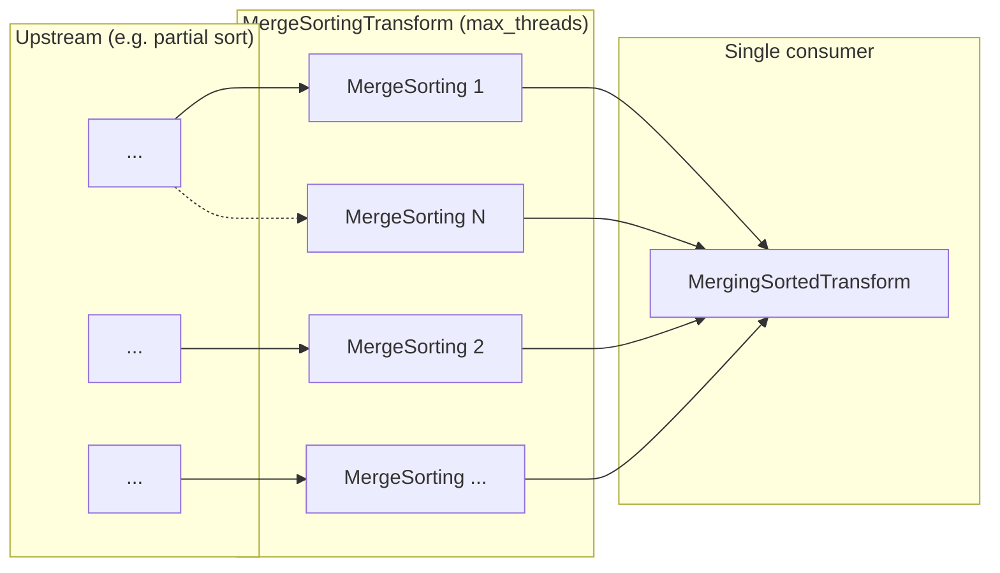
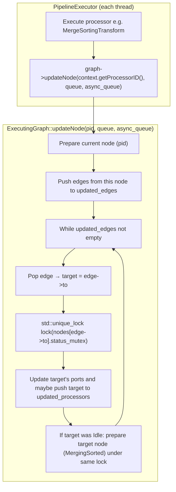
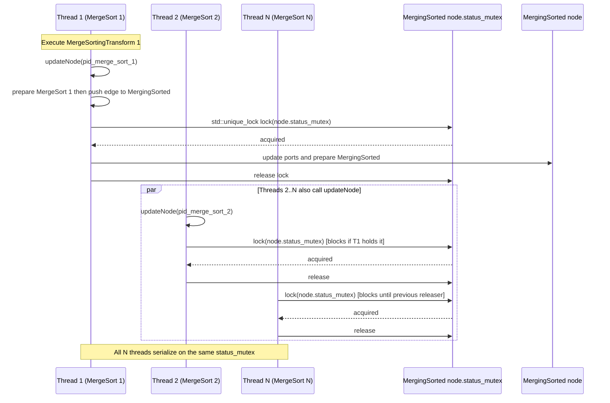
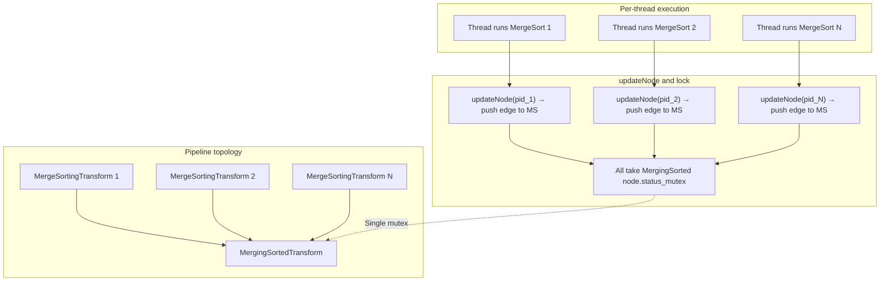

# MergeSortingTransform → MergingSortedTransform and status_mutex contention

This document describes the pipeline pattern where **many MergeSortingTransform nodes** (as many as `max_threads`) feed into **one MergingSortedTransform node**, and how each call to `ExecutingGraph::updateNode` leads to contention on that single node's **status_mutex**, affecting performance.

---

## 1. Pipeline topology

When sorting is parallelized (e.g. in `SortingStep` or similar), the pipeline looks like:

- **N × MergeSortingTransform** (N ≈ `max_threads`) — each runs on a different thread and produces a sorted stream.
- **1 × MergingSortedTransform** — single consumer that merges all N sorted streams.

All N output ports of the MergeSorting transforms connect to the N input ports of the single MergingSorted transform.

So **one node** (MergingSortedTransform) has **N incoming edges** from N producers. Every time a producer pushes data or updates its output port, the graph must update this downstream node, which requires taking that node's **status_mutex**.

---

## 2. Call path: from processor execution to updateNode and status_mutex

After a thread executes a processor (e.g. one of the MergeSortingTransform instances), the pipeline executor calls `updateNode` for **that processor’s ID**. That call eventually updates **all downstream nodes** reachable via direct edges; for each such target it takes **that target’s** `status_mutex`.

So when **thread 1** runs MergeSorting 1 and calls `updateNode(pid_merge_sort_1)`, it will push the edge (MergeSorting 1 → MergingSorted) and then take **MergingSorted’s** `status_mutex`. When **thread 2** runs MergeSorting 2 and calls `updateNode(pid_merge_sort_2)`, it does the same. Thus **N threads** repeatedly contend for **one** mutex: **MergingSorted’s** `status_mutex`.

---

## 3. status_mutex contention (sequence view)

The following sequence diagram shows how multiple executor threads, each running a different MergeSortingTransform, all end up blocking on the **same** `node.status_mutex` (the MergingSorted node’s mutex).

So the **same** `status_mutex` (the one in the MergingSorted pipeline node) is taken:

1. In **updateNode** when processing an edge whose **target** is the MergingSorted node: `std::unique_lock lock(node.status_mutex)` at ExecutingGraph.cpp around line 235 (`node = *nodes[edge->to]`).
2. Again when that target node is prepared (same lock held or re-acquired via `stack_top_lock` around line 268).

Every time any of the N MergeSorting threads finishes a chunk and calls `updateNode`, it eventually tries to take this lock. So **contention is proportional to N** (e.g. `max_threads`).

---

## 4. Where status_mutex is used in ExecutingGraph

| Location | Code | Role |
|----------|------|------|
| **ExecutingGraph.h** ~89 | `std::mutex status_mutex` (per Node) | Protects `Node::status`, `updated_input_ports`, `updated_output_ports`, and the critical section that calls `processor->prepare()`. |
| **ExecutingGraph.cpp** ~170 | `std::lock_guard guard(node.status_mutex)` in expandPipeline | When expanding pipeline, protect updates to the node’s updated_*_ports and status. |
| **ExecutingGraph.cpp** ~235 | `std::unique_lock lock(node.status_mutex)` in updateNode | When processing an **edge**, lock the **target** node (e.g. MergingSorted). This is where N producers serialize on the single consumer’s mutex. |
| **ExecutingGraph.cpp** ~268 | `stack_top_lock.emplace(node.status_mutex)` in updateNode | When preparing the node (e.g. MergingSorted), hold the same mutex across prepare and status updates. |

So a **single** MergingSorted node has **one** `status_mutex`. All edges from the N MergeSorting nodes point to this one node, so all N threads that call `updateNode` after running their MergeSorting processor will, at some point in the same `updateNode` call, take this mutex. The more threads (larger N), the more serialization and the higher the cost.

---

## 5. Performance impact and relation to existing comments

- **Contention**: Up to **max_threads** threads repeatedly compete for **one** mutex. Hold time includes updating port state and calling `processor->prepare()` (and possibly `onUpdatePorts()`) for the MergingSorted node. So both **lock wait time** and **frequency** of locking grow with parallelism.
- **ReadFromMergeTree.cpp** (e.g. around 1230): The comment about “single downstream MergingSortedTransform” is exactly this pattern: one merger and many producers, which leads to contention on that single node’s update path.
- **Mitigations** (as in AggregatingTransform and related patches): Reducing how often or how long the single downstream node is updated (e.g. batching port updates, or changing pipeline shape so that not all producers hit the same node at once) can reduce **status_mutex** contention.

---

## 6. Combined flow (topology + lock)

In short: **many MergeSortingTransform pipeline nodes merging into one MergingSortedTransform** cause **ExecutingGraph::updateNode** to be called from many threads for edges that all point to the same node, so all of them are serialized by that node’s **status_mutex**, which limits scalability and can significantly affect performance when `max_threads` is large.
