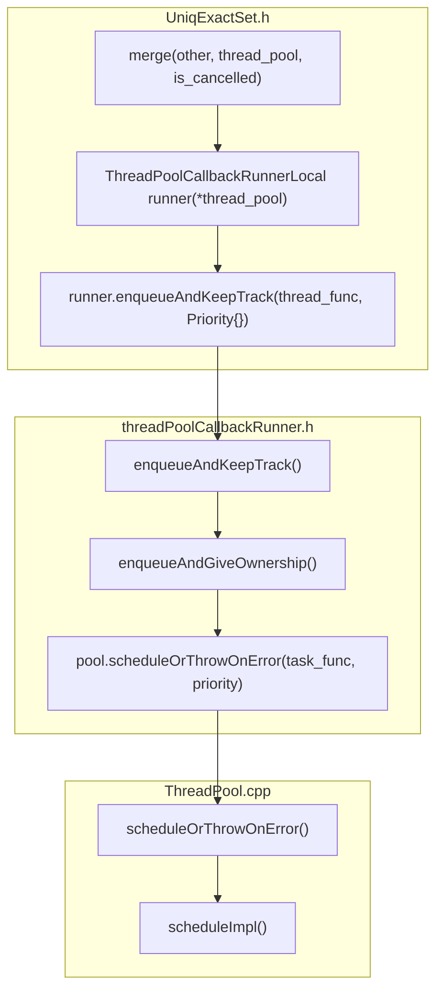
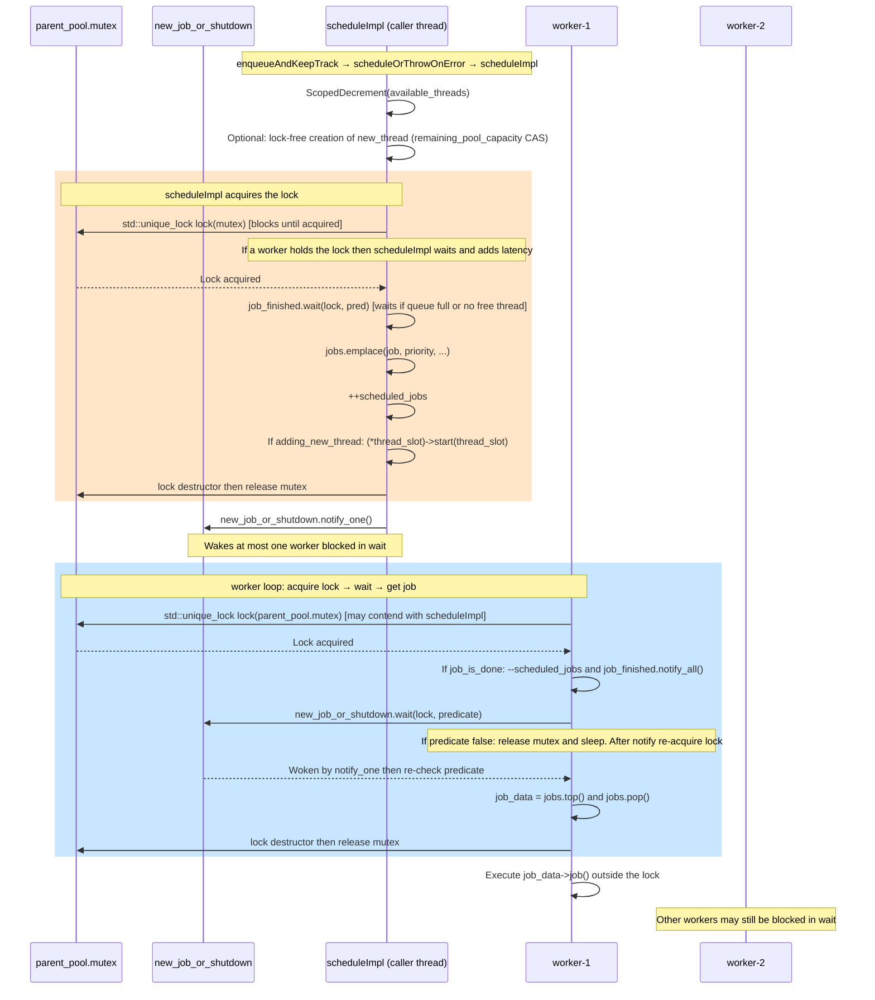
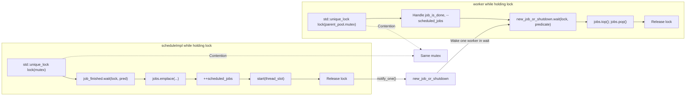
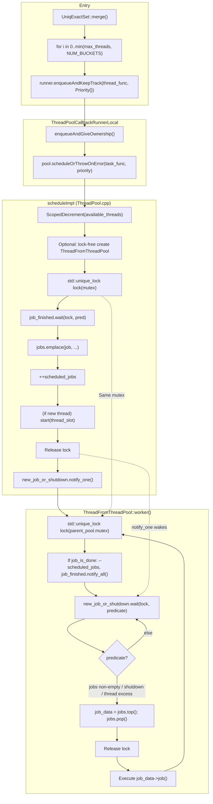

# UniqExactSet::merge → ThreadPool scheduleImpl / worker Flow

This document describes the call path from `runner.enqueueAndKeepTrack(thread_func, Priority{})` inside `UniqExactSet::merge()` to `ThreadPoolImpl::scheduleImpl` and `ThreadFromThreadPool::worker()`, and how the interaction between the **mutex** and **condition_variable** affects performance.

---

## 1. Call chain overview (Mermaid flowchart)

---

## 2. scheduleImpl and worker: lock / condition variable interaction

The sequence diagram below shows contention on the **same mutex** between `scheduleImpl` (producer) and `worker()` (consumer), and how `new_job_or_shutdown` notify/wait ties them together.

---

## 3. How the lock and condition variable affect each other (performance)

### 3.1 Key code locations (lock and wait)

| Location | Code | Purpose |
|----------|------|---------|
| **scheduleImpl** (ThreadPool.cpp ~line 320) | `std::unique_lock lock(mutex);` | Protects `jobs`, `scheduled_jobs`, `threads`; must hold lock before enqueueing |
| **scheduleImpl** (~line 435) | `new_job_or_shutdown.notify_one();` | Called **after** releasing the lock; wakes one worker blocked in `wait` |
| **worker** (~line 719) | `std::unique_lock lock(parent_pool.mutex);` | Contends for the **same** `parent_pool.mutex` as scheduleImpl |
| **worker** (~line 756) | `parent_pool.new_job_or_shutdown.wait(lock, [this]{ return !jobs.empty() \|\| shutdown \|\| ... });` | When predicate is false: **atomically release lock** and sleep; after notify **re-acquire lock** first, then re-check predicate |

### 3.2 Why this interaction causes performance issues

1. **Single mutex contention**
   - Under the lock, `scheduleImpl` does: `job_finished.wait`, `jobs.emplace`, `++scheduled_jobs`, and possibly `start(thread_slot)`.
   - Under the lock, each `worker` does: finish previous job bookkeeping, `--scheduled_jobs`, `job_finished.notify_all`, `new_job_or_shutdown.wait`, and `jobs.top()` / `jobs.pop()`.
   - All queue and counter updates use this one mutex, so **scheduleImpl and every worker contend on the same mutex**. Under high concurrency, lock contention lengthens hold times and increases:
   - Latency of `enqueueAndKeepTrack` (caller must acquire the lock before enqueueing).
   - Latency from “worker is notified” to “worker gets the job” (worker must re-acquire the lock before `jobs.pop()`).

2. **notify_one and wait interaction**
   - `wait(lock, predicate)` **releases the lock and then sleeps** when the predicate is false, so it never sleeps while holding the lock (avoids deadlock).
   - `scheduleImpl` calls `notify_one()` **after** releasing the lock; the woken worker returns from `wait` and **competes again for the lock**. If another `scheduleImpl` call acquires the lock first, that worker blocks again on `lock(mutex)`, adding “woken then immediately blocked on lock” latency.

3. **Bulk enqueue in UniqExactSet::merge**
   - Merge loops over buckets and calls `runner.enqueueAndKeepTrack(thread_func, Priority{})` each time, so each call enters `scheduleImpl` and holds the lock.
   - With many threads (e.g. `min(thread_pool->getMaxThreads(), rhs.NUM_BUCKETS)` large), **many enqueue callers** and **many workers** contend on the same mutex, amplifying the above latency and contention.

---

## 4. Combined flow (including mutex / wait)

---

## 5. Summary

| Mechanism | Role | Performance impact |
|-----------|------|--------------------|
| `std::unique_lock lock(mutex)` (scheduleImpl) | Protects `jobs`, `scheduled_jobs`, `threads` when enqueueing | Longer hold time causes more blocking of workers and other scheduleImpl callers on this lock |
| `std::unique_lock lock(parent_pool.mutex)` (worker) | Get job, update scheduled_jobs, wait for new job | Contends with scheduleImpl on the same mutex; becomes a hot spot under high concurrency |
| `new_job_or_shutdown.wait(lock, predicate)` | When no job: release lock and sleep; after notify, re-acquire lock and re-check | Avoids busy-wait, but after wakeup the thread may block again while re-acquiring the lock |
| `new_job_or_shutdown.notify_one()` (after scheduleImpl releases lock) | Wake one worker blocked in `wait` | Wakeup order is independent of who acquires the lock next; the first woken worker may acquire the lock later than others |

Overall, **scheduleImpl and worker cooperate via the same mutex and the same condition_variable**. In bulk enqueue scenarios like `UniqExactSet::merge`, lock contention and the ordering of notify/wait together affect latency and throughput. The code instruments this via `ProfileEvents::GlobalThreadPoolLockWaitMicroseconds` / `LocalThreadPoolLockWaitMicroseconds` and TRACE logs (e.g. `scheduleImpl_mutex lock time`, `worker_get_job_mutex lock time`, `new_job_or_shutdown.wait() time`).
